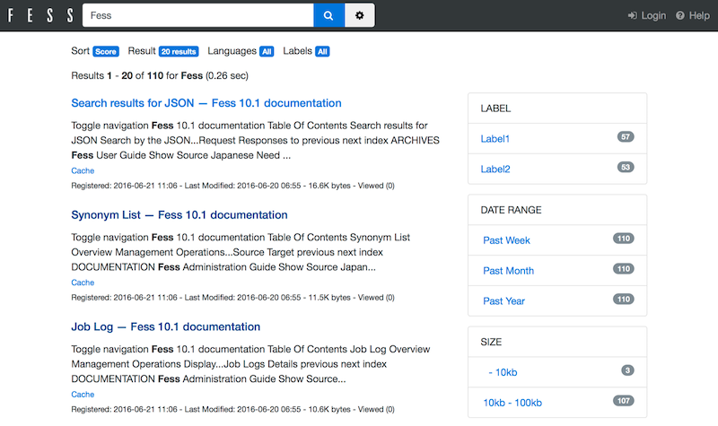

=========================
Getting Started
=========================

User Interfaces
=================

Fess provides 2 user interfaces:

-  Search form and results
-  Administration (used to configure and manage Fess)

Both interfaces are accessible via a web browser.

Search form and results
==========================

This is the primary UI which allows end users to run search queries and view results. Users will type in their query and click *Search* to view the results.

URL: http://localhost:8080/

|Display the search result on a browser|

Administration
==========================

This UI is only used by administrators to configure and manage Fess. Administrators will be prompted to login before they can access the rest of the Administration interface.

URL: http://localhost:8080/admin/

