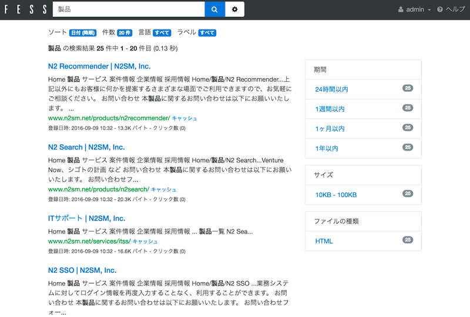

======
How to Use
======

This page describes the basic usage of Fess.
If you haven't installed Fess yet, please refer to :doc:`setup` or :doc:`quick-start`.

About Fess UI
===================

Fess provides the following UIs:

-  Search and search results UI via browser (for general users)
-  Administration UI via browser (for administrators)

Search Screen (For General Users)
===========================

Accessing the Search Screen
------------------

This is the UI for general users to search documents that have been crawled by Fess.

Access http://localhost:8080/ and you will see a search input field and search button.

Basic Search
----------

Enter a search term and click the search button to display search results.

|Browser search results display|

Search results display the following information:

- Title
- URL
- Excerpt from the body (search keywords are highlighted)
- Last updated date
- File size (for documents)

Advanced Search
--------

**AND Search**

Enter multiple keywords separated by spaces to search for documents containing all keywords.

Example: ``Fess search`` → Documents containing both "Fess" and "search"

**OR Search**

Enter ``OR`` between keywords to search for documents containing either keyword.

Example: ``Fess OR Elasticsearch`` → Documents containing "Fess" or "Elasticsearch"

**NOT Search**

Put ``-`` before a keyword to exclude documents containing that keyword.

Example: ``Fess -Elasticsearch`` → Documents containing "Fess" but not "Elasticsearch"

**Phrase Search**

Enclose keywords in ``""`` to search for an exact phrase match.

Example: ``"full-text search"`` → Documents containing the phrase "full-text search"

Search Options
------------

The following options are available on the search screen:

- **Label Search**: Search only documents with specific labels
- **Date Range**: Search only documents updated within a specific period
- **File Type**: Search only specific file types (PDF, Word, etc.)

Administration Screen (For Administrators)
====================

Accessing the Administration Screen
------------------

This is the UI for administrators to manage Fess.

Access http://localhost:8080/admin/ and you will see a login screen.

Default administrator account:

- **Username**: ``admin``
- **Password**: ``admin``

.. warning::

   **Important Security Note**

   Be sure to change the default password.
   Especially in production environments, we strongly recommend changing the password immediately after the first login.

.. note::

   The administration UI does not support Responsive Web Design.
   We recommend accessing from a PC browser.

Main Administration Features
----------

After logging in, you can access the following configuration and management features:

**Crawler Settings**

- Web Crawl Settings
- File System Crawl Settings
- Data Store Crawl Settings

**System Settings**

- General Settings (timezone, mail settings, etc.)
- User and Role Management
- Scheduler Settings
- Design Settings

**Search Settings**

- Label Management
- Keyword Relevance Adjustment
- Synonym and Dictionary Management

For detailed administration instructions, please refer to the User Guide.

Next Steps
==========

After understanding the basic usage, you can refer to the following documents to learn more:

- **User Guide**: Details on crawl settings and search settings
- **API Documentation**: Integration using the REST API
- **Developer Guide**: Customization and extension development

