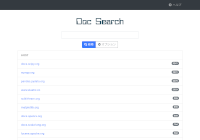
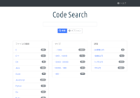

====================================
Enterprise Search Server: |Fess|
====================================

What is Fess?
=============

|Fess| is very powerful and easily deployable Enterprise Search Server.
You can install and run |Fess| quickly on any platforms, which have Java
runtime environment. |Fess| is provided under Apache license.

.. figure:: ../resources/images/en/demo-1.png
   :scale: 100%
   :alt: Demo
   :figclass: side-by-side
   :target: https://search.n2sm.co.jp/

   Demo (Default)

.. figure:: ../resources/images/ja/demo-2.png
   :scale: 100%
   :alt: Code Search
   :figclass: side-by-side
   :target: https://codesearch.codelibs.org/

   Source Code Search

   Document Search

|Fess| is Elasticsearch-based search server,
but knowledge/experience about Elasticsearch is NOT needed because of All-in-One
Enterprise Search Server. |Fess| provides Administration GUI to configure
the system on your browser. |Fess| also contains a crawler, which can
crawl documents on Web/File System/DB and support many file formats,
such as MS Office, pdf and zip.

Download
========

- :doc:`Fess 13.11.1 <downloads>` (zip/rpm/deb packages)

Features
========

-  Very Easy Installation/Configuration

-  Apache License (OSS)

-  OS-independent (Java Application)

-  Crawler for Web/File System/DB/Windows Shared Folder(SMB)

-  Support many document types, such as MS Office, PDF, Zip archive,...

-  Support a web page for BASIC/DIGEST/NTLM/FORM authentication

-  Contain elasticsearch as a search engine (unlimited scalability)

-  Provide UI as a responsive web design (support any device)

-  Provide a browser based administative page (admin console)

-  Support secure search (access control with LDAP/Active Directory)

-  Single Sign On support with SAML/OpenIDConnect

-  Support JSON/GSA format of search results

-  Provide search/click log and statistics

-  Provide auto-complete(suggest)

-  Provide embedded JavaScript library(migration from Google Site Search)

-  Learning To Rank support

-  OCR support

-  Internationalization/Localization

News
====

2021-03-25
    `Fess 13.11.1 <https://github.com/codelibs/fess/releases/tag/fess-13.11.1>`__ Released

2021-03-11
    `Fess 13.11.0 <https://github.com/codelibs/fess/releases/tag/fess-13.11.0>`__ Released

2021-02-28
    `Fess 13.10.4 <https://github.com/codelibs/fess/releases/tag/fess-13.10.4>`__ Released

2021-02-24
    `Fess 13.10.3 <https://github.com/codelibs/fess/releases/tag/fess-13.10.3>`__ Released

2021-01-04
    `Fess 13.10.2 <https://github.com/codelibs/fess/releases/tag/fess-13.10.2>`__ Released

2020-12-10
    `Fess 13.10.1 <https://github.com/codelibs/fess/releases/tag/fess-13.10.1>`__ Released

2020-11-20
    `Fess 13.10.0 <https://github.com/codelibs/fess/releases/tag/fess-13.10.0>`__ Released

2020-11-03
    `Fess 13.9.3 <https://github.com/codelibs/fess/releases/tag/fess-13.9.3>`__ Released

:doc:`More news <news>`...

Discussion
==========

- `Discussion Forum <https://discuss.codelibs.org/c/FessEN/>`__

Fess Site Search
================

`Fess Site Search <https://fss-generator.codelibs.org/docs/manual>`__ is Google Site Search alternative.

Data Store
==========

- `Confluence/Jira <https://github.com/codelibs/fess-ds-atlassian>`__
- `Box <https://github.com/codelibs/fess-ds-box>`__
- `CSV <https://github.com/codelibs/fess-ds-csv>`__
- `Database <https://github.com/codelibs/fess-ds-db>`__
- `Dropbox <https://github.com/codelibs/fess-ds-dropbox>`__
- `Elasticsearch <https://github.com/codelibs/fess-ds-elasticsearch>`__
- `Git <https://github.com/codelibs/fess-ds-git>`__
- `Gitbucket <https://github.com/codelibs/fess-ds-gitbucket>`__
- `G Suite <https://github.com/codelibs/fess-ds-gsuite>`__
- `JSON <https://github.com/codelibs/fess-ds-json>`__
- `Office 365 <https://github.com/codelibs/fess-ds-office365>`__
- `S3 <https://github.com/codelibs/fess-ds-s3>`__
- `Salesforce <https://github.com/codelibs/fess-ds-salesforce>`__
- `SharePoint <https://github.com/codelibs/fess-ds-sharepoint>`__
- `Slack <https://github.com/codelibs/fess-ds-slack>`__

Theme
=====

- `Simple <https://github.com/codelibs/fess-theme-simple>`__
- `Classic <https://github.com/codelibs/fess-theme-classic>`__

Ingester
========

- `Logger <https://github.com/codelibs/fess-ingest-logger>`__
- `NDJSON <https://github.com/codelibs/fess-ingest-ndjson>`__

Support Service
===============

`N2SM, Inc. <https://www.n2sm.net/en/>`__ provides support services for Fess as below.

- N2 Search: Fess based Enterprise Search Software

- `Consulting service <https://www.n2sm.net/en/support/fess_support.html>`__

.. |image0| image:: ../resources/images/en/demo-1.png

.. toctree::
   :hidden:

   overview
   basic
   documentation
   articles
   development
   others
   archives

