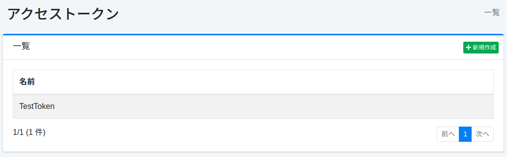

====================
Token de Acceso
====================

Descripción general
===================

La página de configuración de tokens de acceso gestiona los tokens de acceso.

Método de gestión
==================

Método de visualización
-----------------------

Para abrir la página de lista de configuración de tokens de acceso que se muestra a continuación, haga clic en [Sistema > Token de acceso] en el menú izquierdo.

|image0|

Para editar, haga clic en el nombre de la configuración.

Crear configuración
-------------------

Para abrir la página de configuración de token de acceso, haga clic en el botón de nueva creación.

|image1|

Parámetros de configuración
----------------------------

Nombre
::::::

Especifique un nombre para describir este token de acceso.

Permisos
::::::::

Configure los permisos del token de acceso.
Descríbalo en el formato "{user|group|role}nombre".
Por ejemplo, para que los usuarios que pertenecen al grupo developer vean los resultados de búsqueda, configure el permiso como "{group}developer".

Nombre del parámetro
::::::::::::::::::::

Especifique el nombre del parámetro de solicitud al especificar permisos como consulta de búsqueda.

Fecha de vencimiento
::::::::::::::::::::

Especifique la fecha de vencimiento del token de acceso.

Eliminar configuración
----------------------

Haga clic en el nombre de la configuración en la página de lista y haga clic en el botón de eliminar para que aparezca una pantalla de confirmación.
Al presionar el botón de eliminar, se eliminará la configuración.

.. |image0| image:: ../../../resources/images/ja/15.3/admin/accesstoken-1.png

