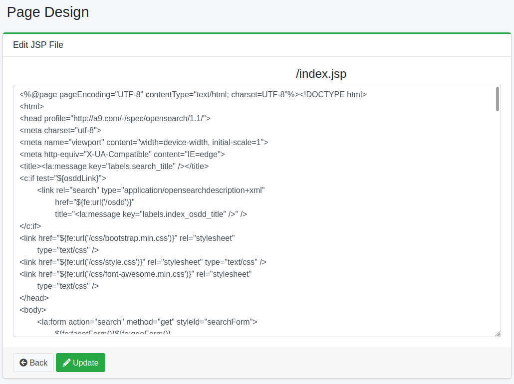

==================
Diseño de Página
==================

Descripción general
===================

Aquí se explica la configuración relacionada con el diseño de la pantalla de búsqueda.

Método de configuración
========================

Método de visualización
-----------------------

Para abrir la página de lista para configurar el diseño de página que se muestra a continuación, haga clic en [Sistema > Diseño de página] en el menú izquierdo.

|image0|

Administrador de archivos
--------------------------

Puede descargar o eliminar archivos disponibles en la pantalla de búsqueda.

Visualización de archivos de página
------------------------------------

Puede editar los archivos JSP de la pantalla de búsqueda.
Puede editar un archivo JSP haciendo clic en el botón de edición del archivo JSP objetivo.
Además, al presionar el botón "Usar predeterminado", puede editarlo como el archivo JSP en el momento de la instalación.
Los cambios se reflejan guardando con el botón de actualización en la pantalla de edición.

A continuación se resume la descripción de las páginas editables.

.. tabularcolumns:: |p{4cm}|p{8cm}|
.. list-table::

   * - /index.jsp
     - Es el archivo JSP de la página principal de búsqueda. Este archivo JSP incluye los archivos JSP de cada parte.
   * - /header.jsp
     - Es el archivo JSP del encabezado.
   * - /footer.jsp
     - Es el archivo JSP del pie de página.
   * - /search.jsp
     - Es el archivo JSP de la página de lista de resultados de búsqueda. Este archivo JSP incluye los archivos JSP de cada parte.
   * - /searchResults.jsp
     - Es el archivo JSP que representa la parte de resultados de búsqueda de la página de lista de resultados de búsqueda. Es el archivo JSP utilizado cuando hay resultados de búsqueda. Cámbielo si desea personalizar la presentación de los resultados de búsqueda.
   * - /searchNoResult.jsp
     - Es el archivo JSP que representa la parte de resultados de búsqueda de la página de lista de resultados de búsqueda. Es el archivo JSP utilizado cuando no hay resultados de búsqueda.
   * - /searchOptions.jsp
     - Es el archivo JSP de la pantalla de opciones de búsqueda.
   * - /advance.jsp
     - Es el archivo JSP de la pantalla de búsqueda avanzada.
   * - /help.jsp
     - Es el archivo JSP de la página de ayuda.
   * - /error/error.jsp
     - Es el archivo JSP de la página de error de búsqueda. Cámbielo si desea personalizar la presentación de errores de búsqueda.
   * - /error/notFound.jsp
     - Es el archivo JSP de la página de error que se muestra cuando no se encuentra una página.
   * - /error/system.jsp
     - Es el archivo JSP de la página de error que se muestra en caso de error del sistema.
   * - /error/redirect.jsp
     - Es el archivo JSP de la página de error que se muestra cuando ocurre una redirección HTTP.
   * - /error/badRequest.jsp
     - Es el archivo JSP de la página de error que se muestra cuando ocurre una solicitud inválida.
   * - /cache.hbs
     - Es el archivo que muestra la caché de los resultados de búsqueda.
   * - /login/index.jsp
     - Es el archivo JSP de la pantalla de inicio de sesión.
   * - /profile/index.jsp
     - Es el JSP de la pantalla de cambio de contraseña para usuarios.
   * - /profile/newpassword.jsp
     - Es el JSP de la pantalla de actualización de contraseña para administradores. Si el nombre de usuario y la contraseña son la misma cadena al iniciar sesión, solicita un cambio de contraseña.

Tabla: Archivos JSP editables

|image1|

Archivos a cargar
-----------------

Puede cargar archivos para usar en la pantalla de búsqueda.
Los nombres de archivo de imagen admitidos son jpg, gif, png, css, js.

Carga de archivo
::::::::::::::::

Especifique el archivo a cargar.

Nombre de archivo (opcional)
:::::::::::::::::::::::::::::

Se utiliza si desea especificar un nombre de archivo para el archivo a cargar.
Si se omite, se utilizará el nombre del archivo cargado.
Por ejemplo, si especifica logo.png, se cambiará la imagen de la página principal de búsqueda.

