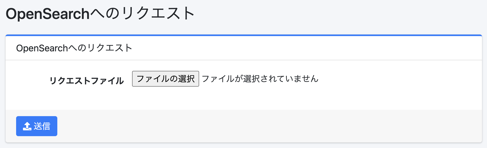

=======================
Solicitud de Consulta
=======================

Descripción general
===================

Esta página envía solicitudes de consulta de archivos JSON a OpenSearch.

|image0|

Método de operación
===================

Envío de solicitud
------------------

Después de iniciar sesión como administrador, ingrese /admin/esreq/ como la ruta de la URL.
Cree la solicitud de consulta que desea enviar a OpenSearch como un archivo JSON, seleccione ese archivo JSON como "Archivo de solicitud" y haga clic en el botón "Enviar" para enviar la solicitud a OpenSearch.
La respuesta se descarga como un archivo.

Parámetros de configuración
----------------------------

Archivo de solicitud
::::::::::::::::::::

Especifique un archivo JSON que describa el DSL de consulta.
Por ejemplo, el contenido del archivo JSON sería el siguiente.

::

    POST /_search
    {
      "query": {
        "match_all": {}
      }
    }

