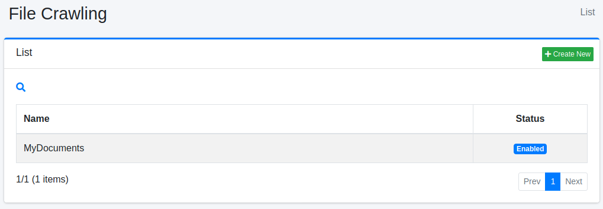
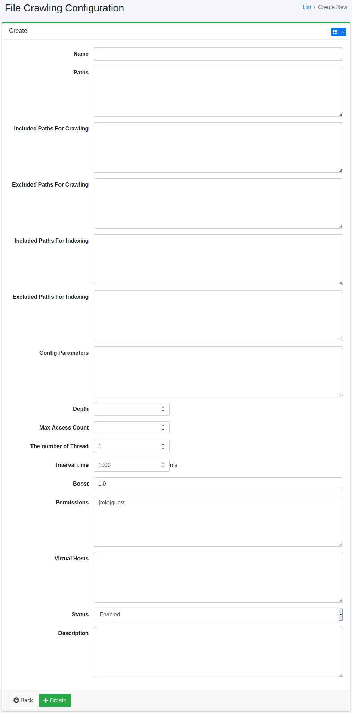

=======================
Rastreo de Sistema de Archivos
=======================

Descripción general
===================

La página de configuración de rastreo de archivos le permite administrar la configuración para rastrear archivos en el sistema de archivos o en carpetas compartidas en la red.

Método de gestión
==================

Método de visualización
-----------------------

Para abrir la página de lista para configurar el rastreo de archivos que se muestra a continuación, haga clic en [Rastreador > Sistema de archivos] en el menú izquierdo.

|image0|

Para editar, haga clic en el nombre de la configuración.

Crear configuración
-------------------

Para abrir la página de configuración de rastreo de archivos, haga clic en el botón de nueva creación.

|image1|

Parámetros de configuración
----------------------------

Nombre
::::::

Es el nombre de la configuración.

Ruta
::::

En esta ruta, especifique dónde comenzar el rastreo (ejemplo: file:/ o smb://).

Rutas a rastrear
::::::::::::::::

Las rutas que coincidan con la expresión regular (formato Java) especificada en este elemento serán objeto del rastreador de |Fess|.

Rutas excluidas del rastreo
::::::::::::::::::::::::::::

Las rutas que coincidan con la expresión regular (formato Java) especificada en este elemento no serán objeto del rastreador de |Fess|.

Rutas a buscar
::::::::::::::

Las rutas que coincidan con la expresión regular (formato Java) especificada en este elemento serán objeto de búsqueda.

Rutas excluidas de la búsqueda
:::::::::::::::::::::::::::::::

Las rutas que coincidan con la expresión regular (formato Java) especificada en este elemento no serán objeto de búsqueda.

Parámetros de configuración
::::::::::::::::::::::::::::

Puede especificar información de configuración de rastreo.

Profundidad
:::::::::::

Especifique la profundidad de la estructura del sistema de archivos a rastrear.

Número máximo de accesos
:::::::::::::::::::::::::

Especifique el número de rutas a indexar.

Número de hilos
:::::::::::::::

Especifique el número de hilos a utilizar para esta configuración.

Intervalo
:::::::::

Especifique el tiempo de espera cada vez que un hilo rastrea una ruta.

Valor de impulso
::::::::::::::::

El valor de impulso es la prioridad de los documentos indexados por esta configuración.

Permisos
::::::::

Especifique el permiso para esta configuración.
La forma de especificar permisos es, por ejemplo, para mostrar resultados de búsqueda a usuarios que pertenecen al grupo developer, especifique {group}developer.
La especificación por usuario es {user}nombre_usuario, la especificación por rol es {role}nombre_rol, y la especificación por grupo es {group}nombre_grupo.

Host virtual
::::::::::::

Especifique el nombre de host del host virtual.
Para más detalles, consulte :doc:`Host virtual en la guía de configuración <../config/virtual-host>`.

Estado
::::::

Cuando esta configuración está habilitada, el trabajo del rastreador predeterminado realizará el rastreo incluyendo esta configuración.

Descripción
:::::::::::

Puede ingresar una descripción.

Eliminar configuración
----------------------

Haga clic en el nombre de la configuración en la página de lista y haga clic en el botón de eliminar para que aparezca una pantalla de confirmación. Al presionar el botón de eliminar, se eliminará la configuración.

Ejemplo
=======

Rastrear archivos locales
--------------------------

Para rastrear archivos bajo /home/share, la configuración sería la siguiente.

.. tabularcolumns:: |p{4cm}|p{8cm}|
.. list-table::
   :header-rows: 1

   * - Nombre
     - Valor
   * - Nombre
     - Directorio compartido
   * - Ruta
     - file:/home/share

Los otros parámetros pueden usar la configuración predeterminada.

Rastrear carpeta compartida de Windows
---------------------------------------

Para rastrear archivos bajo \\SERVER\SharedFolder, la configuración sería la siguiente.

.. tabularcolumns:: |p{4cm}|p{8cm}|
.. list-table::
   :header-rows: 1

   * - Nombre
     - Valor
   * - Nombre
     - Carpeta compartida
   * - Ruta
     - smb://SERVER/SharedFolder/

Si se requiere nombre de usuario/contraseña para acceder a la carpeta compartida, es necesario crear una configuración de autenticación de archivos desde [Rastreador > Autenticación de archivos] en el menú izquierdo.
En ese caso, la configuración sería la siguiente.

.. tabularcolumns:: |p{4cm}|p{8cm}|
.. list-table::
   :header-rows: 1

   * - Nombre
     - Valor
   * - Nombre de host
     - SERVER
   * - Esquema
     - SAMBA
   * - Nombre de usuario
     - (Ingrese)
   * - Contraseña
     - (Ingrese)

.. pdf            :height: 940 px
