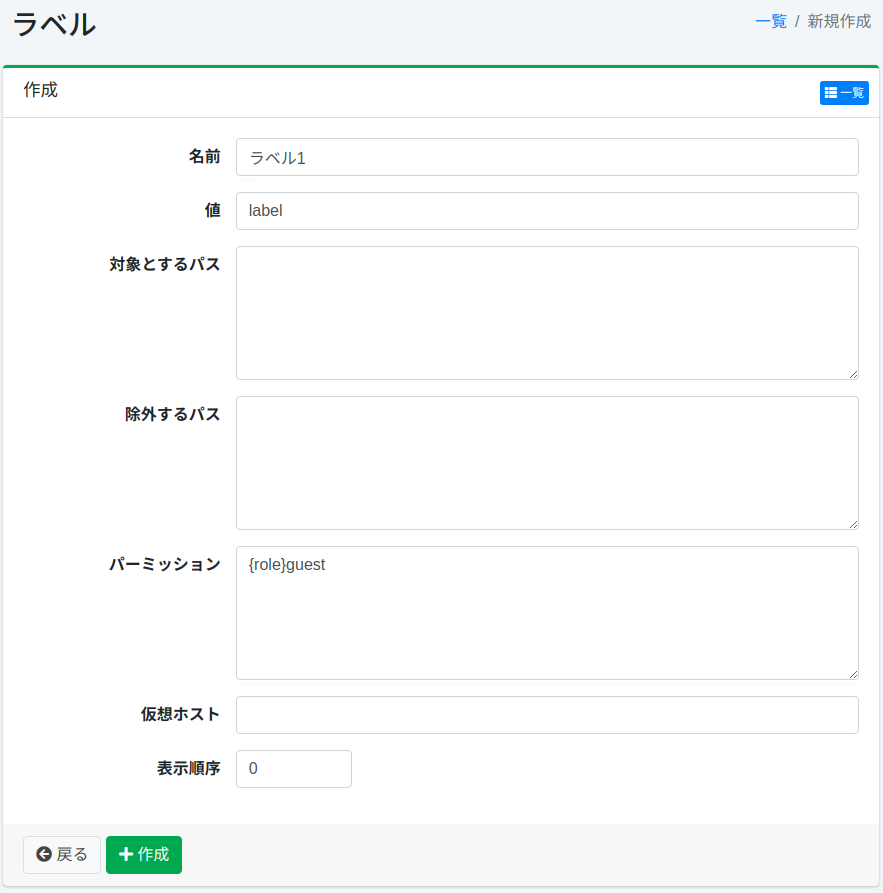

==========
Etiquetas
==========

Descripción general
===================

Aquí se explica la configuración relacionada con las etiquetas.
Las etiquetas pueden clasificar los documentos que se muestran en los resultados de búsqueda.
La configuración de etiquetas especifica con expresiones regulares las rutas a las que se agregarán etiquetas.
Si registra etiquetas, se mostrará un cuadro desplegable de etiquetas en las opciones de búsqueda.

Esta configuración de etiquetas se aplica a la configuración de rastreo web o del sistema de archivos.

Método de gestión
==================

Método de visualización
-----------------------

Para abrir la página de lista de configuración de etiquetas que se muestra a continuación, haga clic en [Rastreador > Etiquetas] en el menú izquierdo.

|image0|

Para editar, haga clic en el nombre de la configuración.

Crear configuración
-------------------

Para abrir la página de configuración de etiquetas, haga clic en el botón de nueva creación.

|image1|

Parámetros de configuración
----------------------------

Nombre
::::::

Especifique el nombre que se mostrará en el cuadro desplegable de selección de etiquetas durante la búsqueda.

Valor
:::::

Especifique el identificador al clasificar documentos.
Especifíquelo en caracteres alfanuméricos.

Rutas objetivo
::::::::::::::

Configure con expresiones regulares las rutas a las que se agregarán etiquetas.
Puede especificar múltiples rutas describiéndolas en múltiples líneas.
Se configurará la etiqueta en los documentos que coincidan con las rutas especificadas aquí.

Rutas excluidas
:::::::::::::::

Configure con expresiones regulares las rutas que desea excluir del objetivo entre las rutas objetivo de rastreo.
Puede especificar múltiples rutas describiéndolas en múltiples líneas.

Permisos
::::::::

Especifique el permiso para esta configuración.
La forma de especificar permisos es, por ejemplo, para mostrar resultados de búsqueda a usuarios que pertenecen al grupo developer, especifique {group}developer.
La especificación por usuario es {user}nombre_usuario, la especificación por rol es {role}nombre_rol, y la especificación por grupo es {group}nombre_grupo.

Host virtual
::::::::::::

Especifique el nombre de host del host virtual.
Para más detalles, consulte :doc:`Host virtual en la guía de configuración <../config/virtual-host>`.

Orden de visualización
:::::::::::::::::::::::

Especifique el orden de visualización de las etiquetas.

Eliminar configuración
----------------------

Haga clic en el nombre de la configuración en la página de lista y haga clic en el botón de eliminar para que aparezca una pantalla de confirmación.
Al presionar el botón de eliminar, se eliminará la configuración.

.. |image0| image:: ../../../resources/images/ja/15.3/admin/labeltype-1.png

