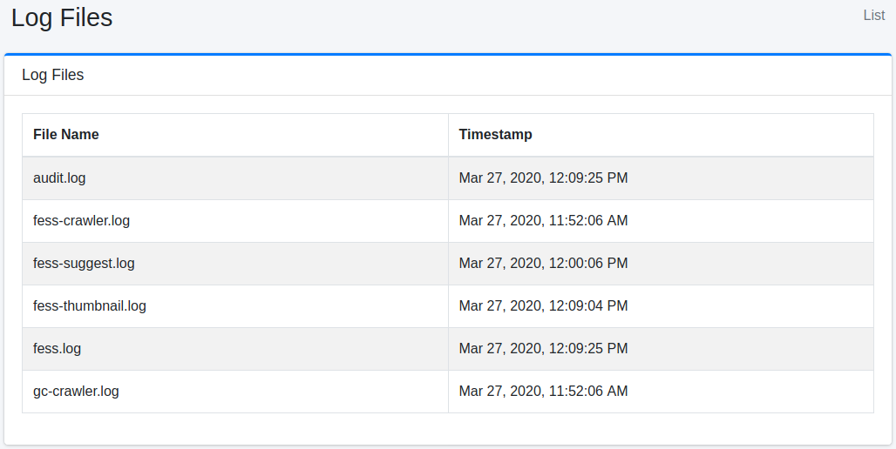

==================
Archivo de Registro
==================

Descripción general
===================

Aquí se explica la descarga de archivos de registro generados por |Fess|.

Método de configuración
========================

Método de visualización
-----------------------

Para abrir la página de archivos de registro que se muestra a continuación, haga clic en [Información del sistema > Archivo de registro] en el menú izquierdo.

|image0|

Descarga
--------

Puede descargar el archivo de registro haciendo clic en el nombre del archivo de registro que se muestra.

``server_*.log``
::::::::::::::::

Se registran los registros de |Fess| como servidor de aplicaciones.

fess.log
::::::::

Se registran los registros de |Fess| como aplicación.

fess-crawler.log
::::::::::::::::

Se registran los registros del rastreador.

audit.log
:::::::::

Se registran la información de inicio de sesión y los registros de acceso a la pantalla de administración.

fess-thumbnail.log
::::::::::::::::::

Se registran los registros de la función de miniaturas.

fess-suggest.log
::::::::::::::::

Se registran los registros de la función de sugerencias.

fess-urls.log
:::::::::::::

Se registra el tiempo que tardó un rastreo.

search.log
::::::::::

Se registran los registros de búsqueda.

gc-crawler.log
::::::::::::::

Se registran los registros de GC de fess.

