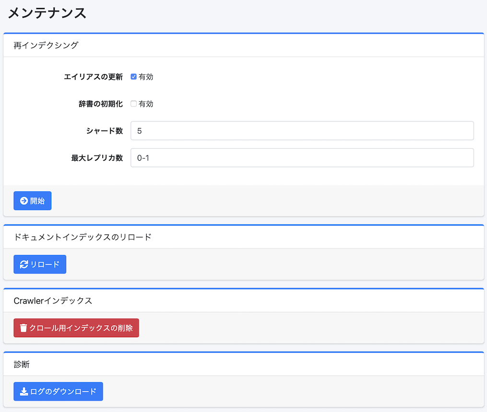

===============
Mantenimiento
===============

Descripción general
===================

La página de mantenimiento se utiliza al ejecutar operaciones de datos del sistema.

|image0|

Método de operación
===================

Reindexación
------------

Puede recrear un nuevo índice a partir del índice fess existente.
Se ejecuta cuando desea cambiar el mapeo del índice, etc.

Parámetros de configuración
----------------------------

Actualizar alias
::::::::::::::::

Al habilitarlo, después de que se complete la reindexación, puede reasignar los alias fess.search y fess.update asignados al índice existente al nuevo índice.

Inicializar diccionarios
:::::::::::::::::::::::::

Al habilitarlo, puede inicializar la configuración de los diccionarios.

Número de fragmentos
:::::::::::::::::::::

Puede especificar el número de fragmentos de OpenSearch (index.number_of_shards).

Número máximo de réplicas
::::::::::::::::::::::::::

Puede especificar el número máximo de réplicas de OpenSearch (index.auto_expand_replicas).

Recargar índice de documentos
------------------------------

Puede recargar el índice de documentos para reflejar la configuración del índice.

Índice de Rastreador
--------------------

Puede eliminar el índice fess_crawler (información de rastreo).
No lo ejecute mientras el rastreador esté en ejecución.

Diagnóstico
-----------

Puede descargar archivos de registro en formato zip.

