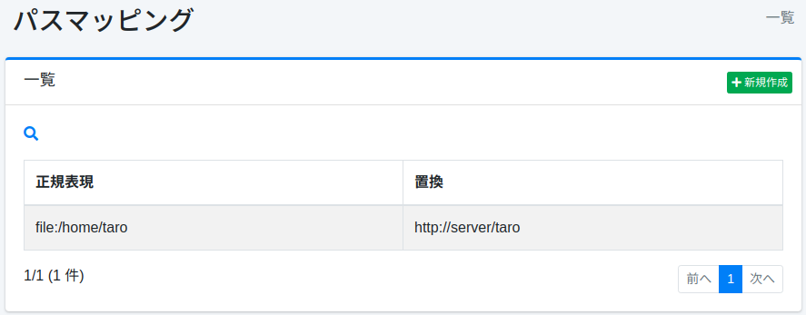
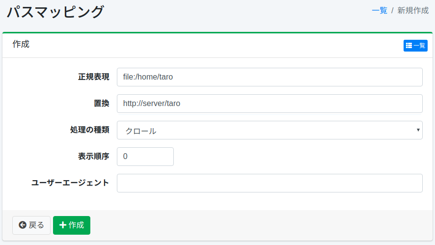

================
Mapeo de Rutas
================

Descripción general
===================

Aquí se explica la configuración relacionada con el mapeo de rutas.
El mapeo de rutas se puede utilizar cuando desea reemplazar los enlaces que se muestran en los resultados de búsqueda, etc.

Método de gestión
==================

Método de visualización
-----------------------

Para abrir la página de lista de configuración de mapeo de rutas que se muestra a continuación, haga clic en [Rastreador > Mapeo de rutas] en el menú izquierdo.

|image0|

Para editar, haga clic en el nombre de la configuración.

Crear configuración
-------------------

Para abrir la página de configuración de mapeo de rutas, haga clic en el botón de nueva creación.

|image1|

Parámetros de configuración
----------------------------

Expresión regular
:::::::::::::::::

Especifique la cadena que desea reemplazar.
El método de descripción sigue las expresiones regulares de Java.

Reemplazo
:::::::::

Especifique la cadena que reemplazará la expresión regular coincidente.

Tipo de procesamiento
:::::::::::::::::::::

Especifique el momento del reemplazo.

* Rastreo: Reemplaza la URL después de obtener el documento durante el rastreo, antes de indexar.
* Visualización: Reemplaza la URL antes de mostrar durante la búsqueda.
* Rastreo/Visualización: Reemplaza la URL tanto en rastreo como en visualización.
* URL guardada: Reemplaza la URL antes de obtener el documento durante el rastreo.

Orden de visualización
:::::::::::::::::::::::

Puede especificar el orden de procesamiento del mapeo de rutas.
Se procesa en orden ascendente.

Eliminar configuración
----------------------

Haga clic en el nombre de la configuración en la página de lista y haga clic en el botón de eliminar para que aparezca una pantalla de confirmación.
Al presionar el botón de eliminar, se eliminará la configuración.

