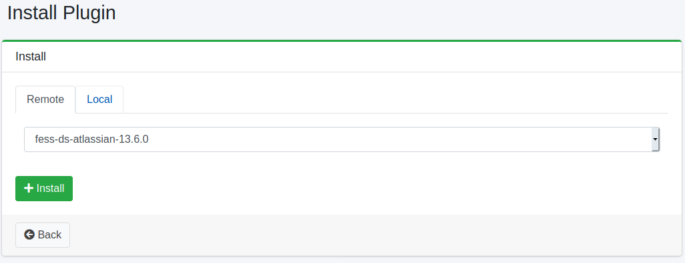

==========
Complemento
==========

Descripción general
===================

La página de configuración de complementos gestiona los complementos.

Método de gestión
==================

Método de visualización
-----------------------

Para abrir la página de lista de complementos instalados que se muestra a continuación, haga clic en [Sistema > Complemento] en el menú izquierdo.

|image0|

Para desinstalar, haga clic en el botón de eliminar.

Instalación
-----------

Para instalar un nuevo complemento, haga clic en el botón de instalación.

|image1|

Seleccione el complemento que desea instalar en el menú desplegable y haga clic en el botón de instalación para comenzar la instalación.

.. |image0| image:: ../../../resources/images/en/15.3/admin/plugin-1.png

