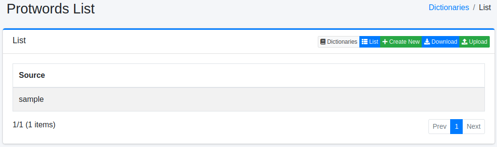

========================
Diccionario de Protwords
========================

Descripción general
===================

Puede administrar palabras que se excluirán del procesamiento de stemming.
El procesamiento de stemming es básicamente un procesamiento basado en reglas, por lo que puede ocurrir una normalización no deseada.
Por ejemplo, la palabra Maine (nombre de un estado de EE. UU.) se normaliza a main.

Método de gestión
==================

Método de visualización
-----------------------

Para abrir la página de lista de configuración de Protwords que se muestra a continuación, seleccione [Sistema > Diccionario] en el menú izquierdo y luego haga clic en protwords.

|image0|

Para editar, haga clic en el nombre de la configuración.

Método de configuración
-----------------------

Para abrir la página de configuración de Protwords, haga clic en el botón de nueva creación.

|image1|

Parámetros de configuración
----------------------------

Información de la palabra
::::::::::::::::::::::::::

Ingrese las palabras que se excluirán del procesamiento de stemming.

Descarga
========

Puede descargar en el formato de diccionario de Protwords.

Carga
=====

Puede cargar en el formato de diccionario de Protwords.

.. |image1| image:: ../../../resources/images/en/15.3/admin/protwords-2.png
