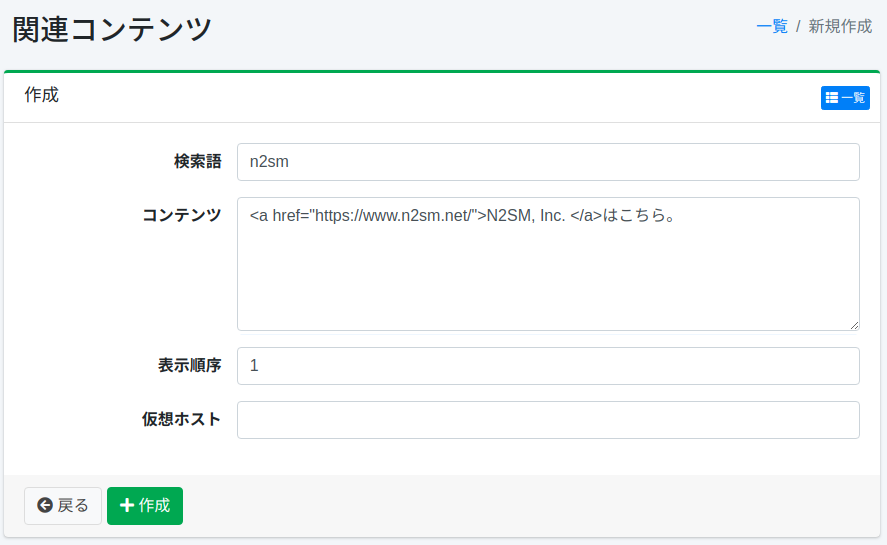

=======================
Contenido Relacionado
=======================

Descripción general
===================

Aquí se explica la configuración de contenido relacionado.
Si la consulta de búsqueda coincide con el término de búsqueda especificado, puede mostrar contenido relacionado en la parte superior de los resultados de búsqueda.

Método de gestión
==================

Método de visualización
-----------------------

Para abrir la página de lista para configurar el contenido relacionado que se muestra a continuación, haga clic en [Rastreador > Contenido relacionado] en el menú izquierdo.

|image0|

Para editar, haga clic en el nombre de la configuración.

Crear configuración
-------------------

Para abrir la página de configuración de contenido relacionado, haga clic en el botón de nueva creación.

|image1|

Parámetros de configuración
----------------------------

Término de búsqueda
:::::::::::::::::::

Especifique el término de búsqueda que desea coincidir con la consulta de búsqueda.

Contenido
:::::::::

Especifique el contenido que desea mostrar en los resultados de búsqueda.

Host virtual
::::::::::::

Especifique el nombre de host del host virtual.
Para más detalles, consulte :doc:`Host virtual en la guía de configuración <../config/virtual-host>`.

Eliminar configuración
----------------------

Haga clic en el nombre de la configuración en la página de lista y haga clic en el botón de eliminar para que aparezca una pantalla de confirmación.
Al presionar el botón de eliminar, se eliminará la configuración.

.. |image0| image:: ../../../resources/images/ja/15.3/admin/relatedcontent-1.png

