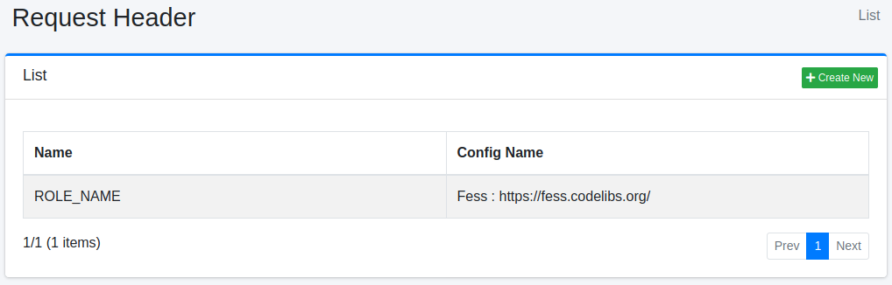
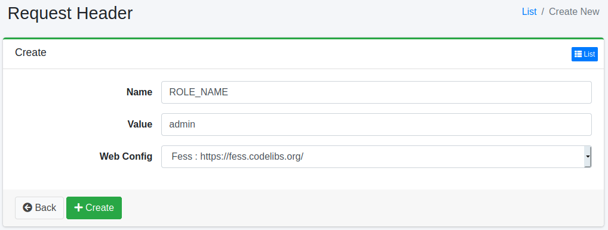

===========================
Encabezado de Solicitud
===========================

Descripción general
===================

Aquí se explica la configuración relacionada con los encabezados de solicitud.
La función de encabezado de solicitud es información de encabezado de solicitud que se agrega a la solicitud al rastrear y obtener documentos.
Por ejemplo, se puede utilizar en casos donde el sistema de autenticación ve la información del encabezado y, si hay un valor específico, inicia sesión automáticamente.

Método de gestión
==================

Método de visualización
-----------------------

Para abrir la página de lista de configuración de encabezados de solicitud que se muestra a continuación, haga clic en [Rastreador > Encabezado de solicitud] en el menú izquierdo.

|image0|

Para editar, haga clic en el nombre de la configuración.

Crear configuración
-------------------

Para abrir la página de configuración de encabezado de solicitud, haga clic en el botón de nueva creación.

|image1|

Parámetros de configuración
----------------------------

Nombre
::::::

Especifique el nombre del encabezado de solicitud al agregarlo a la solicitud.

Valor
:::::

Especifique el valor del encabezado de solicitud al agregarlo a la solicitud.

Configuración web
:::::::::::::::::

Seleccione el nombre de configuración de rastreo web al que se agregará el encabezado de solicitud.
El encabezado de solicitud se agregará solo en la configuración de rastreo seleccionada.

Eliminar configuración
----------------------

Haga clic en el nombre de la configuración en la página de lista y haga clic en el botón de eliminar para que aparezca una pantalla de confirmación.
Al presionar el botón de eliminar, se eliminará la configuración.

