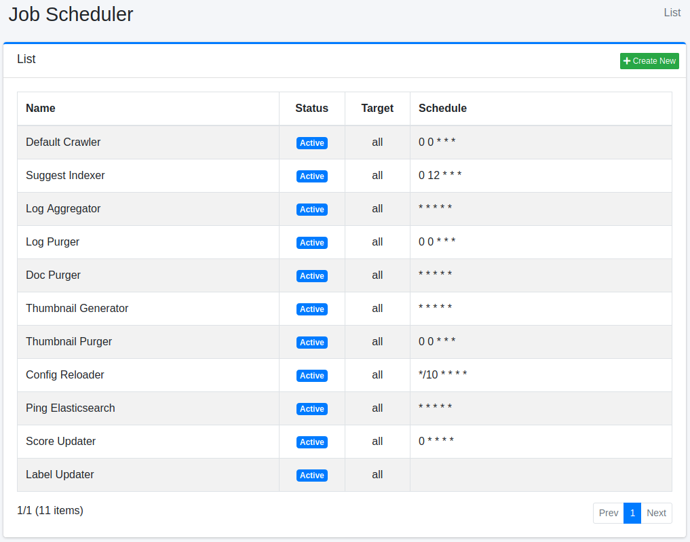
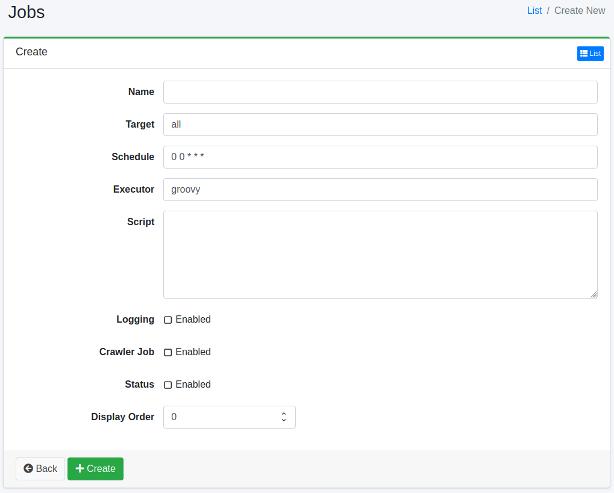

=================
Programador de Tareas
=================

Descripción general
===================

Aquí se explica la configuración relacionada con el programador de tareas.

Método de gestión
==================

Método de visualización
-----------------------

Para abrir la página de lista de configuración del programador de tareas que se muestra a continuación, haga clic en [Sistema > Programador] en el menú izquierdo.

|image0|

Para editar, haga clic en el nombre de la configuración.

Crear configuración
-------------------

Para abrir la página de configuración del programador, haga clic en el botón de nueva creación.

|image1|

Parámetros de configuración
----------------------------

Nombre
::::::

Es el nombre que se muestra en la lista.

Destino
:::::::

El destino se puede utilizar como identificador para determinar si ejecutar o no el trabajo al ejecutarlo directamente con un comando en un lote, etc.
Si no ejecuta el rastreo mediante comandos, especifique "all".

Programación
::::::::::::

Configure la programación.
El trabajo descrito en el script se ejecutará según la programación configurada aquí.

El formato de descripción es formato CRON con el formato "minuto hora día mes día_de_la_semana".
Por ejemplo, "0 12 \* \* 3" ejecutará el trabajo todos los miércoles a las 12:00 PM.

Método de ejecución
:::::::::::::::::::

Especifique el entorno de ejecución del script.
Actualmente solo se admite "groovy".

Script
::::::

Describa el contenido de ejecución del trabajo en el lenguaje especificado en el método de ejecución.

Por ejemplo, si desea ejecutar solo tres configuraciones de rastreo como trabajo de rastreo, descríbalo de la siguiente manera (asumiendo que los ID de configuración de rastreo web son 1 y 2, y el ID de configuración de rastreo del sistema de archivos es 1).

::

    return container.getComponent("crawlJob").logLevel("info").webConfigIds(["1", "2"] as String[]).fileConfigIds(["1"] as String[]).dataConfigIds([] as String[]).execute(executor);

Registro
::::::::

Al habilitarlo, se registrará en el registro de trabajos.

Trabajo del rastreador
::::::::::::::::::::::

Al habilitarlo, se tratará como un trabajo del rastreador.
Al configurar job.max.crawler.processes en fess_config.properties, puede evitar que se inicien más rastreadores de lo necesario.
De forma predeterminada, no hay límite en el número de rastreadores que se pueden iniciar.

Estado
::::::

Especifique el estado habilitado/deshabilitado del trabajo.
Si se deshabilita, el trabajo no se ejecutará.

Orden de visualización
:::::::::::::::::::::::

Especifique el orden de visualización en la lista de trabajos.

Eliminar configuración
----------------------

Haga clic en el nombre de la configuración en la página de lista y haga clic en el botón de eliminar para que aparezca una pantalla de confirmación.
Al presionar el botón de eliminar, se eliminará la configuración.

Método de rastreo manual
=========================

Haga clic en "Default Crawler" en "Programador" y luego haga clic en el botón "Iniciar ahora".
Para detener el rastreador, haga clic en "Default Crawler" y luego haga clic en el botón "Detener".

