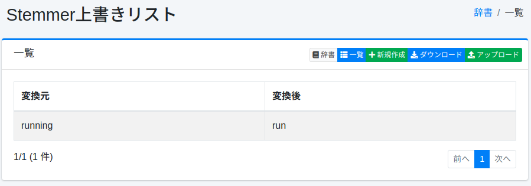
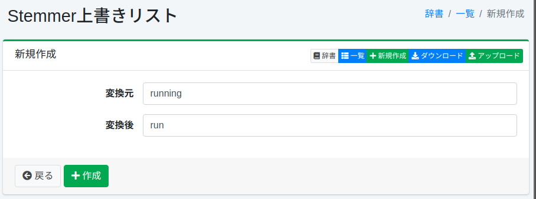

====================================
Diccionario de Anulación de Stemmer
====================================

Descripción general
===================

Puede anular el procesamiento de stemmer para caracteres específicos (símbolos, códigos de caracteres, ancho completo/medio) con otros caracteres.

Método de gestión
==================

Método de visualización
-----------------------

Para abrir la página de lista de configuración de anulación de Stemmer que se muestra a continuación, seleccione [Sistema > Diccionario] en el menú izquierdo y luego haga clic en stemmeroverride.

|image0|

Para editar, haga clic en el nombre de la configuración.

Método de configuración
-----------------------

Para abrir la página de configuración de anulación de Stemmer, haga clic en el botón de nueva creación.

|image1|

Parámetros de configuración
----------------------------

Origen de la conversión
:::::::::::::::::::::::

Ingrese los caracteres (símbolos, códigos de caracteres, ancho completo/medio) que serán objeto de la anulación de Stemmer.

Después de la conversión
:::::::::::::::::::::::::

Expanda los caracteres ingresados en el origen de la conversión con los caracteres después de la conversión.

Descarga
========

Puede descargar en el formato de diccionario de anulación de Stemmer.

Carga
=====

Puede cargar en el formato de diccionario de anulación de Stemmer.

