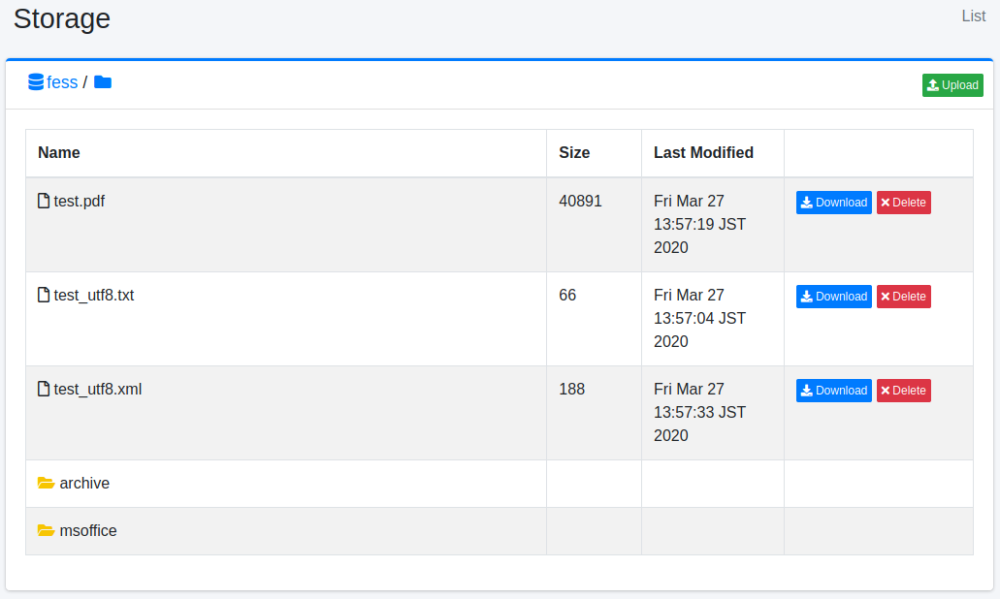

==============
Almacenamiento
==============

Descripción general
===================

La página de almacenamiento le permite administrar archivos en MinIO, un almacenamiento de objetos compatible con Amazon S3.

Método de gestión
==================

Configuración del servidor de almacenamiento de objetos
--------------------------------------------------------

Abra la configuración de almacenamiento desde [Sistema > General] y configure los siguientes elementos:

- Punto de acceso: URL del punto de acceso del servidor de almacenamiento
- Clave de acceso: Clave de acceso del servidor de almacenamiento
- Clave secreta: Clave secreta del servidor de almacenamiento
- Bucket: Nombre del bucket a administrar

Método de visualización
-----------------------

Para abrir la página de lista de objetos que se muestra a continuación, haga clic en [Sistema > Almacenamiento] en el menú izquierdo.

|image0|

Nombre
::::::

Nombre del archivo del objeto

Tamaño
::::::

Tamaño del objeto

Fecha de última actualización
::::::::::::::::::::::::::::::

Fecha de última actualización del objeto

Descarga
--------

Puede descargar el objeto haciendo clic en el botón de descarga.

Eliminar
--------

Puede eliminar el objeto haciendo clic en el botón de eliminar.

Carga
-----

Puede abrir la ventana de carga de archivos haciendo clic en el botón de carga de archivos en la esquina superior derecha.

Crear carpeta
-------------

Puede abrir la ventana de creación de carpeta haciendo clic en el botón de crear carpeta a la derecha de la visualización de ruta. Tenga en cuenta que no se pueden crear carpetas vacías.

