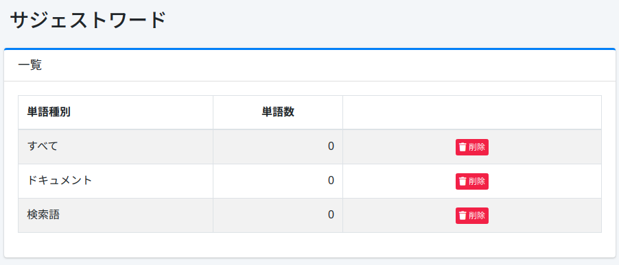

=======================
Palabra de Sugerencia
=======================

Descripción general
===================

La página de palabras de sugerencia administra las palabras que se muestran en las sugerencias de palabras clave.

Método de gestión
==================

Método de visualización
-----------------------

Para abrir la página de lista de palabras de sugerencia que se muestra a continuación, haga clic en [Sugerencia > Palabra de sugerencia] en el menú izquierdo.

|image0|

Si desea eliminar, haga clic en el botón de eliminar.

Tipo de palabra
:::::::::::::::

- Todas: Todas las palabras registradas
- Documento: Palabras generadas a partir de documentos indexados
- Término de búsqueda: Palabras generadas a partir de registros de búsqueda

Número de palabras
::::::::::::::::::

Número de palabras registradas

