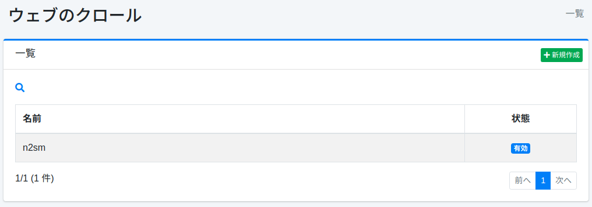
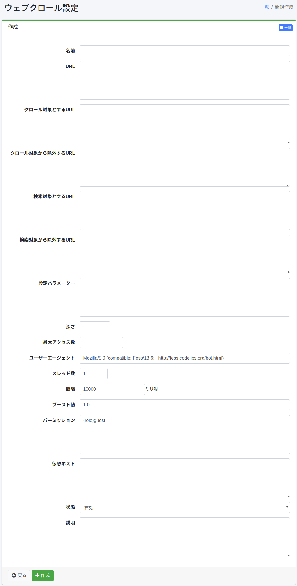

================
Rastreo Web
================

Descripción general
===================

La página de configuración de rastreo web configura el rastreo web.

Método de gestión
==================

Método de visualización
-----------------------

Para abrir la página de lista de configuración de rastreo web que se muestra a continuación, haga clic en [Rastreador > Web] en el menú izquierdo.

|image0|

Para editar, haga clic en el nombre de la configuración.

Crear configuración
-------------------

Para abrir la página de configuración de rastreo web, haga clic en el botón de creación.

|image1|

Parámetros de configuración
----------------------------

Nombre
::::::

Nombre de la configuración.

URL
:::

URL que será el punto de inicio del rastreo.

URL a rastrear
::::::::::::::

Las URL que coincidan con la expresión regular (formato Java) especificada en este elemento serán objeto del rastreador de |Fess|.

URL excluidas del rastreo
::::::::::::::::::::::::::

Las URL que coincidan con la expresión regular (formato Java) especificada en este elemento no serán objeto del rastreador de |Fess|.

URL a buscar
::::::::::::

Las URL que coincidan con la expresión regular (formato Java) especificada en este elemento serán objeto de búsqueda.

URL excluidas de la búsqueda
:::::::::::::::::::::::::::::

Las URL que coincidan con la expresión regular (formato Java) especificada en este elemento no serán objeto de búsqueda.

Parámetros de configuración
::::::::::::::::::::::::::::

Puede especificar información de configuración de rastreo.

Profundidad
:::::::::::

Puede especificar la profundidad al seguir enlaces contenidos en documentos rastreados.

Número máximo de accesos
:::::::::::::::::::::::::

Número de URLs que se indexarán.

Agente de usuario
:::::::::::::::::

Nombre del rastreador de |Fess|.

Número de hilos
:::::::::::::::

Número de hilos de rastreo en esta configuración.

Intervalo
:::::::::

Intervalo de tiempo en cada hilo al rastrear URLs.

Valor de impulso
::::::::::::::::

Peso de los documentos indexados en esta configuración.

Permisos
::::::::

Especifique el permiso para esta configuración.
La forma de especificar permisos es, por ejemplo, para mostrar resultados de búsqueda a usuarios que pertenecen al grupo developer, especifique {group}developer.
La especificación por usuario es {user}nombre_usuario, la especificación por rol es {role}nombre_rol, y la especificación por grupo es {group}nombre_grupo.

Host virtual
::::::::::::

Especifique el nombre de host del host virtual.
Para más detalles, consulte :doc:`../config/virtual-host`.

Estado
::::::

Si está habilitado, el trabajo programado del rastreador predeterminado incluirá esta configuración.

Descripción
:::::::::::

Puede ingresar una descripción.

Eliminar configuración
----------------------

Haga clic en el nombre de la configuración en la página de lista y haga clic en el botón de eliminar para que aparezca una pantalla de confirmación. Al presionar el botón de eliminar, se eliminará la configuración.

Ejemplo
=======

Rastrear fess.codelibs.org
--------------------------

Para crear una configuración de rastreo web que rastree páginas debajo de https://fess.codelibs.org/, use los siguientes valores de configuración.

.. tabularcolumns:: |p{4cm}|p{8cm}|
.. list-table::
   :header-rows: 1

   * - Elemento de configuración
     - Valor de configuración
   * - Nombre
     - Fess
   * - URL
     - https://fess.codelibs.org/
   * - URL a rastrear
     - https://fess.codelibs.org/.*

Use los valores predeterminados para los otros valores de configuración.

Rastreo web de sitios con autenticación web
--------------------------------------------

Fess admite el rastreo de autenticación BASIC, autenticación DIGEST y autenticación NTLM.
Para obtener más detalles sobre la autenticación web, consulte la página de autenticación web.

Redmine
:::::::

Para crear una configuración de rastreo web que rastree páginas de Redmine protegidas con contraseña (ej. https://<server>/), use los siguientes valores de configuración.

.. tabularcolumns:: |p{4cm}|p{8cm}|
.. list-table::
   :header-rows: 1

   * - Elemento de configuración
     - Valor de configuración
   * - Nombre
     - Redmine
   * - URL
     - https://<server>/my/page
   * - URL a rastrear
     - https://<server>/.*
   * - Parámetros de configuración
     - client.robotsTxtEnabled=false (Opcional)

Después de eso, cree la configuración de autenticación web con los siguientes valores de configuración.

.. tabularcolumns:: |p{4cm}|p{8cm}|
.. list-table::
   :header-rows: 1

   * - Elemento de configuración
     - Valor de configuración
   * - Esquema
     - Form
   * - Nombre de usuario
     - (Cuenta para rastreo)
   * - Contraseña
     - (Contraseña para la cuenta)
   * - Parámetros
     - | encoding=UTF-8
       | token_method=GET
       | token_url=https://<server>/login
       | token_pattern=name="authenticity_token"[^>]+value="([^"]+)"
       | token_name=authenticity_token
       | login_method=POST
       | login_url=https://<server>/login
       | login_parameters=username=${username}&password=${password}
   * - Autenticación web
     - Redmine

XWiki
:::::

Para crear una configuración de rastreo web que rastree páginas de XWiki (ej. https://<server>/xwiki/), use los siguientes valores de configuración.

.. tabularcolumns:: |p{4cm}|p{8cm}|
.. list-table::
   :header-rows: 1

   * - Elemento de configuración
     - Valor de configuración
   * - Nombre
     - XWiki
   * - URL
     - https://<server>/xwiki/bin/view/Main/
   * - URL a rastrear
     - https://<server>/.*
   * - Parámetros de configuración
     - client.robotsTxtEnabled=false (Opcional)

Después de eso, cree la configuración de autenticación web con los siguientes valores de configuración.

.. tabularcolumns:: |p{4cm}|p{8cm}|
.. list-table::
   :header-rows: 1

   * - Elemento de configuración
     - Valor de configuración
   * - Esquema
     - Form
   * - Nombre de usuario
     - (Cuenta para rastreo)
   * - Contraseña
     - (Contraseña para la cuenta)
   * - Parámetros
     - | encoding=UTF-8
       | token_method=GET
       | token_url=http://<server>/xwiki/bin/login/XWiki/XWikiLogin
       | token_pattern=name="form_token" +value="([^"]+)"
       | token_name=form_token
       | login_method=POST
       | login_url=http://<server>/xwiki/bin/loginsubmit/XWiki/XWikiLogin
       | login_parameters=j_username=${username}&j_password=${password}
   * - Autenticación web
     - XWiki

.. pdf            :height: 940 px
