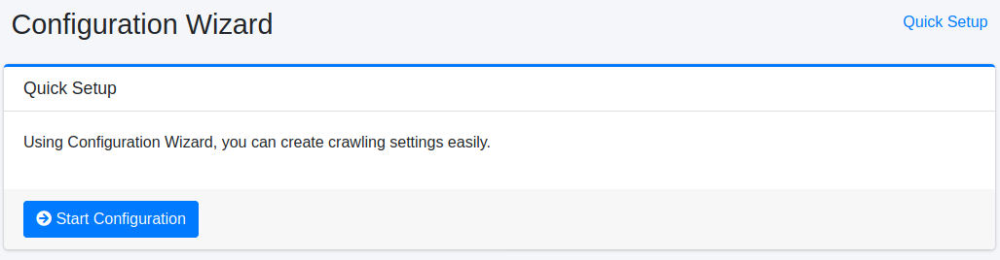
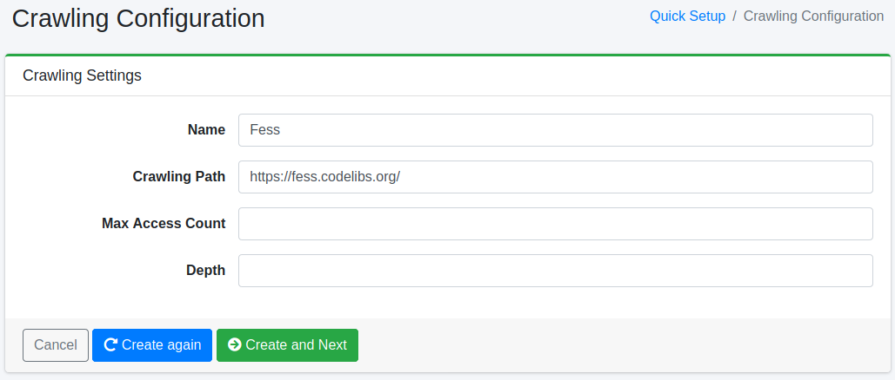

=======================
Asistente de Configuración
=======================

Descripción general
===================

La página del asistente proporciona una herramienta de configuración simplificada para registrar configuraciones de rastreo.

Configuración simplificada
---------------------------

Esta es una página de inicio para registrar configuraciones de rastreo.

|image0|

Configuración del rastreo
--------------------------

En esta página puede crear configuraciones de rastreo.

|image1|

Parámetros de configuración
----------------------------

Nombre
::::::

Especifique el nombre de la configuración (ejemplo: Sitio de Fess).

Ruta de rastreo
:::::::::::::::

Especifique la URL o ruta del archivo del punto de inicio del rastreo (ejemplo: https://fess.codelibs.org/).

Número máximo de accesos
:::::::::::::::::::::::::

Establezca el límite superior de páginas que se rastrearán.

Profundidad
:::::::::::

Establezca la profundidad al seguir enlaces contenidos en documentos rastreados.

Rastreador
----------

Para iniciar el rastreador de |Fess|, haga clic en el botón "Iniciar rastreo". Si aún no desea rastrear, haga clic en el botón "Omitir".

|image2|

.. |image2| image:: ../../../resources/images/en/15.3/admin/wizard-3.png
