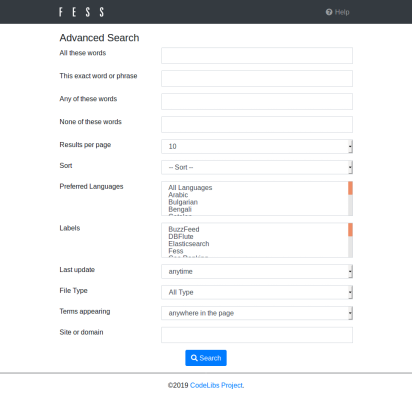

================
Búsqueda avanzada
================

La pantalla de búsqueda avanzada permite realizar búsquedas más complejas.

Cómo utilizar
-------------

Se puede acceder a la pantalla de búsqueda avanzada desde el botón de búsqueda avanzada en las opciones de la pantalla de búsqueda.

|image0|

Puede realizar la búsqueda presionando el botón de búsqueda en la parte inferior de la página.

Lista de elementos
------------------

Contiene todas las palabras
::::::::::::::::::::::::::::

Puede buscar documentos que contengan todas las palabras ingresadas.
Las palabras se separan con espacios.

Coincidencia exacta incluyendo el orden de las palabras
::::::::::::::::::::::::::::::::::::::::::::::::::::::::

Puede buscar documentos que contengan la cadena de texto ingresada.
No se puede separar con espacios u otros caracteres.

Contiene alguna de las palabras
::::::::::::::::::::::::::::::::

Puede buscar documentos que contengan alguna de las palabras ingresadas.
Las palabras se separan con espacios.

No contiene palabras
::::::::::::::::::::

Puede buscar documentos que no contengan ninguna de las palabras ingresadas.
Las palabras se separan con espacios.

Número de resultados mostrados
:::::::::::::::::::::::::::::::

Puede especificar el número de resultados de búsqueda que se incluirán en una página de resultados.

Ordenar
:::::::

Puede ordenar los resultados de búsqueda especificando campos como la fecha de búsqueda.

Idioma preferido
::::::::::::::::

Puede especificar el idioma preferido en los resultados de búsqueda.

Etiqueta
::::::::

Puede realizar búsquedas filtradas por información de etiquetas. Si no hay etiquetas registradas, no se mostrará.

Fecha de actualización
::::::::::::::::::::::

Puede realizar búsquedas filtradas por la fecha y hora de actualización del documento.

Formato de archivo
::::::::::::::::::

Puede realizar búsquedas filtradas por el formato de archivo del documento.

Objetivo de búsqueda
::::::::::::::::::::

Puede especificar el objetivo de búsqueda entre toda la página, título de página o URL de página.

Sitio o dominio
:::::::::::::::

Puede realizar búsquedas filtradas por el sitio o dominio ingresado.

