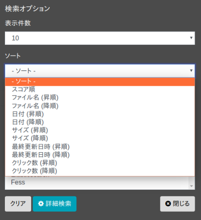

========================
Búsqueda con ordenamiento
========================

Puede ordenar los resultados de búsqueda especificando campos como la fecha de búsqueda.

Campos de ordenamiento
----------------------

Por defecto, puede ordenar especificando los siguientes campos:

.. list-table::
   :header-rows: 1

   * - Nombre del campo
     - Descripción
   * - created
     - Fecha y hora de rastreo
   * - content_length
     - Tamaño del documento rastreado
   * - last_modified
     - Fecha de última modificación del documento rastreado
   * - filename
     - Nombre del archivo
   * - score
     - Valor de puntuación
   * - timestamp
     - Fecha y hora de indexación del documento
   * - click_count
     - Número de clics en el documento
   * - favorite_count
     - Número de veces que el documento se agregó a favoritos

Tabla: Lista de campos de ordenamiento

También puede personalizar y agregar sus propios campos como objetivos de ordenamiento.

Cómo utilizar
-------------

Puede seleccionar condiciones de ordenamiento en el momento de la búsqueda. Las condiciones de ordenamiento se pueden seleccionar en el diálogo de opciones de búsqueda que se muestra al presionar el botón de opciones.

|image0|

Además, para ordenar en el campo de búsqueda, ingrese "sort:nombre_del_campo" separando sort y el nombre del campo con dos puntos (:) en el formulario de búsqueda.

Lo siguiente busca fess como término de búsqueda y ordena el tamaño del documento en orden ascendente:

::

    fess sort:content_length

Para ordenar en orden descendente, haga lo siguiente:

::

    fess sort:content_length.desc

Para ordenar por múltiples campos, especifíquelos separados por comas como se muestra a continuación:

::

    fess sort:content_length.desc,last_modified

.. pdf            :width: 300 px
