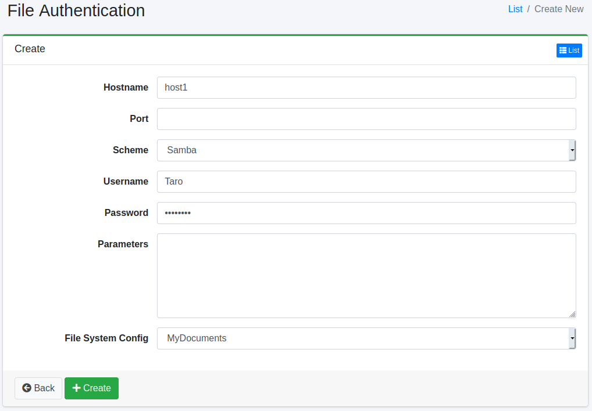

==========================
Autenticación de Archivos
==========================

Descripción general
===================

Aquí se explica el método de configuración cuando se requiere autenticación de archivos para el rastreo dirigido a archivos.
|Fess| admite la autenticación para FTP o carpetas compartidas de Windows.

Método de gestión
==================

Método de visualización
-----------------------

Para abrir la página de lista para configurar la autenticación de archivos que se muestra a continuación, haga clic en [Rastreador > Autenticación de archivos] en el menú izquierdo.

|image0|

Para editar, haga clic en el nombre de la configuración.

Crear configuración
-------------------

Para abrir la página de configuración de autenticación de archivos, haga clic en el botón de nueva creación.

|image1|

Parámetros de configuración
----------------------------

Nombre de host
::::::::::::::

Especifique el nombre de host del sitio que requiere autenticación.

Puerto
::::::

Especifique el puerto del sitio que requiere autenticación.

Esquema
:::::::

Seleccione el método de autenticación.
Puede utilizar FTP o SAMBA (autenticación de carpeta compartida de Windows).

Nombre de usuario
:::::::::::::::::

Especifique el nombre de usuario para iniciar sesión en el sitio de autenticación.

Contraseña
::::::::::

Especifique la contraseña para iniciar sesión en el sitio de autenticación.

Parámetros
::::::::::

Configure si hay valores de configuración necesarios para iniciar sesión en el sitio de autenticación. Para SAMBA, puede configurar el valor de domain. Si desea configurarlo, descríbalo de la siguiente manera:

::

    domain=FUGA

Configuración de rastreo de archivos
:::::::::::::::::::::::::::::::::::::

Especifique la configuración de rastreo que utilizará esta configuración de autenticación.

Eliminar configuración
----------------------

Haga clic en el nombre de la configuración en la página de lista y haga clic en el botón de eliminar para que aparezca una pantalla de confirmación.
Al presionar el botón de eliminar, se eliminará la configuración.

.. |image0| image:: ../../../resources/images/en/15.4/admin/fileauth-1.png

