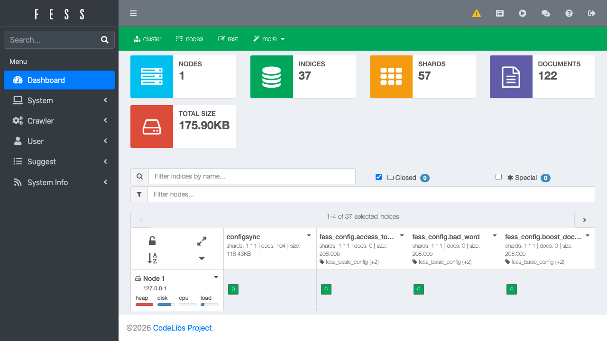
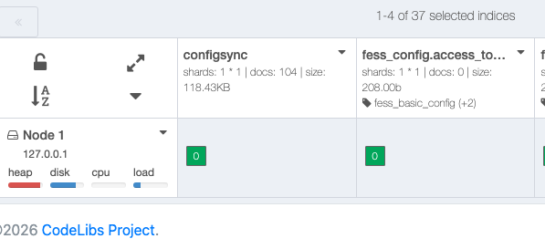

==================
Panel de Control
==================

Descripción general
===================

El panel de control proporciona una herramienta de administración web para gestionar el clúster e índices de OpenSearch a los que accede |Fess|.

|image0|

.. tabularcolumns:: |p{4cm}|p{8cm}|
.. list-table:: Índices gestionados por |Fess|
   :header-rows: 1

   * - Nombre del índice
     - Descripción
   * - fess.YYYYMMDD
     - Documentos indexados
   * - fess_log
     - Registro de accesos
   * - fess.suggest.YYYYMMDD
     - Palabras de sugerencia
   * - fess_config
     - Configuración de |Fess|
   * - fess_user
     - Datos de usuarios/roles/grupos
   * - configsync
     - Configuración de diccionarios
   * - fess_suggest
     - Metadatos de sugerencias
   * - fess_suggest_array
     - Metadatos de sugerencias
   * - fess_suggest_badword
     - Lista de palabras prohibidas en sugerencias
   * - fess_suggest_analyzer
     - Metadatos de sugerencias
   * - fess_crawler
     - Información de rastreo

Los nombres de índices que comienzan con un punto (.) son índices del sistema y no se muestran.
Para mostrar también los índices del sistema, active la casilla de verificación "special".

Verificar el número de documentos indexados
============================================

El número de documentos indexados se muestra en el índice fess, como se muestra en la figura siguiente.

|image1|

Al hacer clic en el icono de la esquina superior derecha de cada índice, se muestra un menú de operaciones para el índice.
Si desea eliminar documentos indexados, elimínelos desde la pantalla de búsqueda administrativa. Tenga cuidado de no eliminarlos con "delete index".

.. pdf            :width: 400 px
