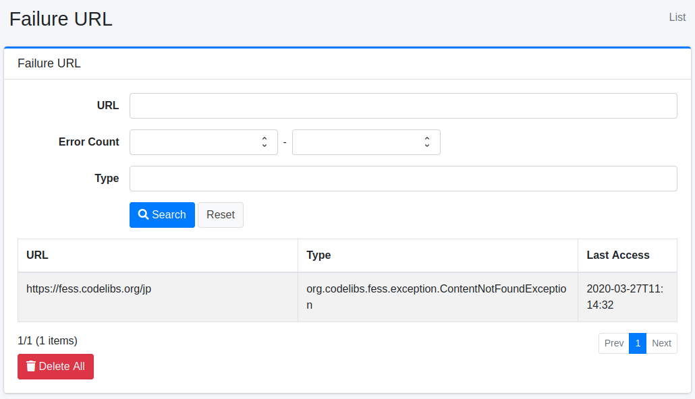
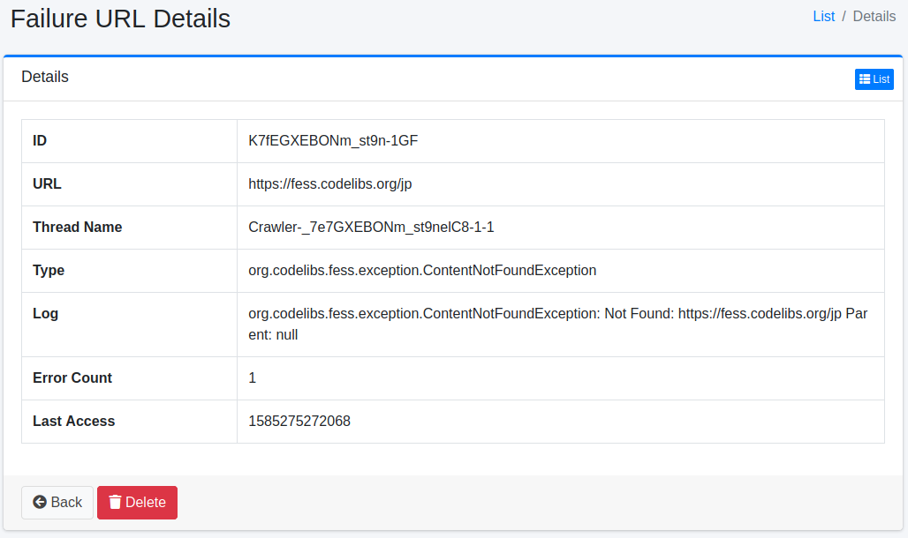

============
URL de fallo
============

Descripción general
===================

Aquí se explica sobre las URL de fallo.
Las URL que no se pudieron obtener durante el rastreo se registran y se pueden verificar como URL de fallo.

Método de gestión
==================

Método de visualización
-----------------------

Para abrir la página de lista para verificar las URL de fallo, haga clic en [Información del sistema > URL de fallo] en el menú izquierdo.

|image0|

Al hacer clic en el enlace de verificación de URL de fallo, se muestran los detalles.

Detalles de URL de fallo
==========================

Los detalles de URL de fallo registran las excepciones que ocurrieron durante el rastreo.

|image1|

Contenido de los detalles
--------------------------

URL
:::

URL en la que ocurrió la excepción.

Nombre del hilo
:::::::::::::::

Nombre del hilo que estaba ejecutando el rastreo.
Se puede utilizar al verificar archivos de registro.

Tipo
::::

Tipo de excepción.

Registro
::::::::

Contenido de la excepción.

Número de errores
:::::::::::::::::

Número de veces que ocurrió esta excepción.

Fecha del último acceso
:::::::::::::::::::::::

Hora en la que ocurrió esta excepción.

