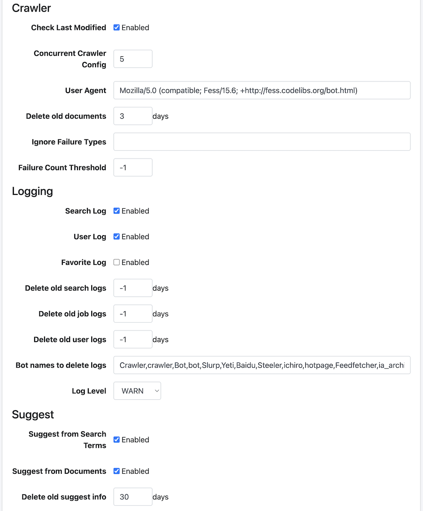
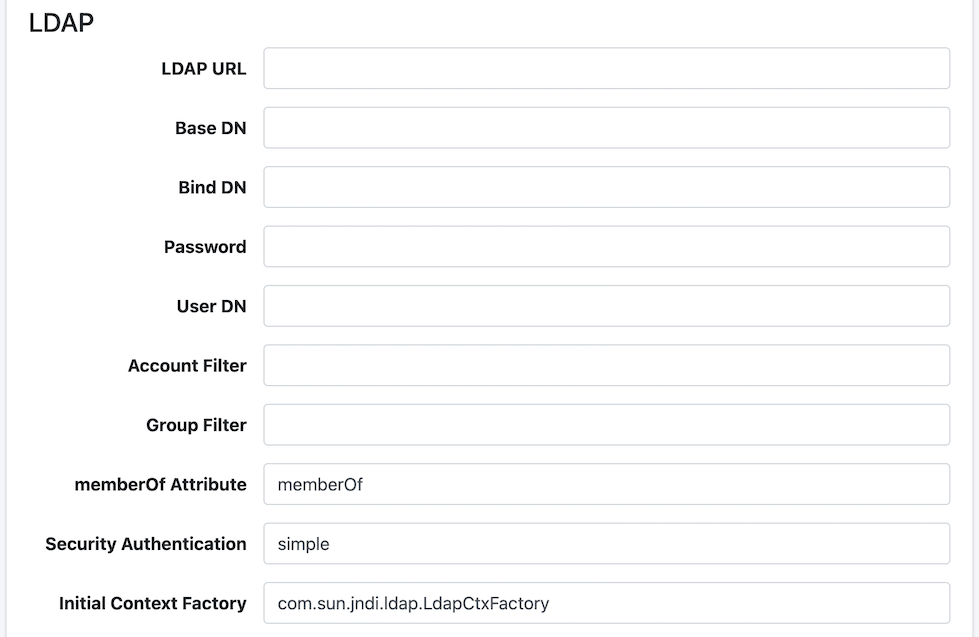
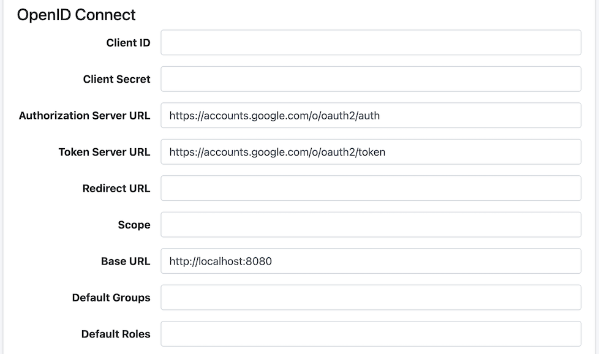
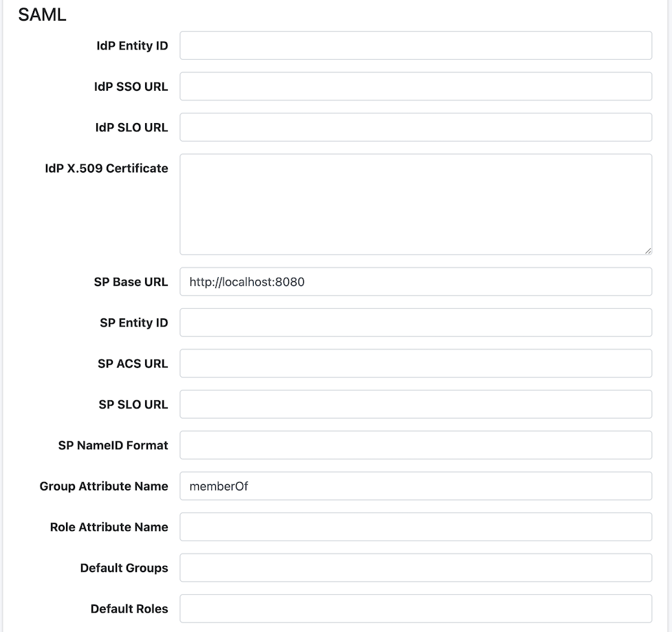
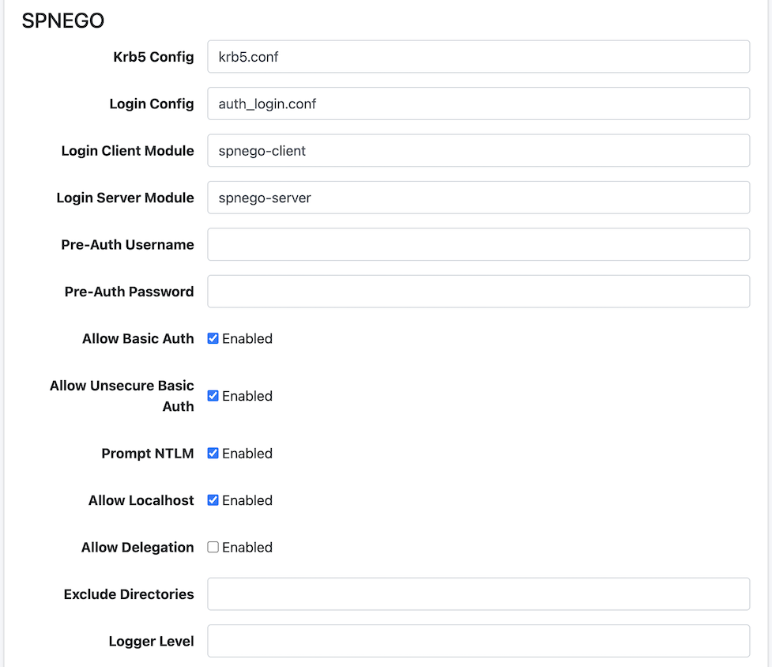
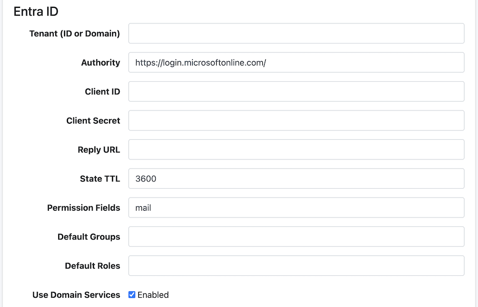
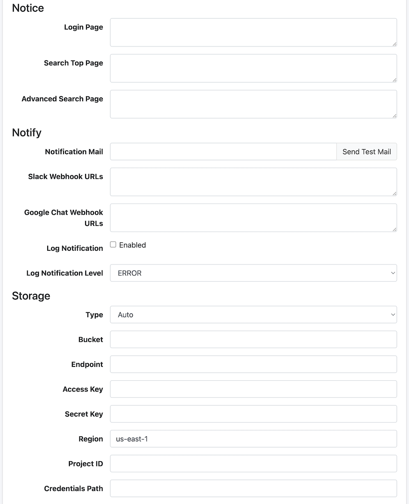

=======
General
=======

Descripción general
===================

En esta página de administración, puede gestionar la configuración de |Fess|.
Puede cambiar varias configuraciones de |Fess| sin necesidad de reiniciarlo.

Contenido de la configuración
==============================

Sistema
-------

|image0|

Respuesta JSON
::::::::::::::

Especifique si desea habilitar la API JSON.

Requiere inicio de sesión
:::::::::::::::::::::::::

Especifique si desea hacer que el inicio de sesión sea obligatorio para la función de búsqueda.

Mostrar enlace de inicio de sesión
:::::::::::::::::::::::::::::::::::

Configure si desea mostrar el enlace a la página de inicio de sesión en la pantalla de búsqueda.

Contraer resultados duplicados
:::::::::::::::::::::::::::::::

Configure si desea habilitar la contracción de resultados duplicados.

Mostrar miniatura
::::::::::::::::::

Configure si desea habilitar la visualización de miniaturas.

Propiedades del sistema
:::::::::::::::::::::::

Configura las propiedades del sistema de |Fess|.
Especifique en formato ``clave=valor``, una por línea.

Valor de etiqueta por defecto
:::::::::::::::::::::::::::::

Describa el valor de etiqueta que se agregará a las condiciones de búsqueda de forma predeterminada.
Si especifica por rol o grupo, añada "role:" o "group:" como en "role:admin=label1".

Valor de ordenación por defecto
::::::::::::::::::::::::::::::::

Describa el valor de ordenamiento que se agregará a las condiciones de búsqueda de forma predeterminada.
Si especifica por rol o grupo, añada "role:" o "group:" como en "role:admin=content_length.desc".

Host virtual
::::::::::::

Configure el host virtual.
Para más detalles, consulte :doc:`Host virtual en la guía de configuración <../config/security-virtual-host>`.

Respuesta de palabras populares
::::::::::::::::::::::::::::::::

Especifique si desea habilitar la API de palabras populares.

Codificación de archivo CSV
:::::::::::::::::::::::::::

Especifique la codificación de los archivos CSV que se descargarán.

Añadir parámetro de búsqueda
::::::::::::::::::::::::::::

Habilite esto si desea pasar parámetros a la visualización de resultados de búsqueda.

Proxy de archivos de búsqueda
:::::::::::::::::::::::::::::

Especifique si desea habilitar el proxy de archivos para los resultados de búsqueda.

Usar configuración regional del navegador
::::::::::::::::::::::::::::::::::::::::::

Especifique si desea usar la configuración regional del navegador para la búsqueda.

Tipo de SSO
:::::::::::

Especifica el tipo de inicio de sesión único (Single Sign-On).

- **Ninguno**: No usar SSO
- **OpenID Connect**: Usar OpenID Connect
- **SAML**: Usar SAML
- **SPNEGO**: Usar SPNEGO
- **Entra ID**: Usar Microsoft Entra ID

Rastreador
----------

|image1|

Comprobar fecha de última modificación
:::::::::::::::::::::::::::::::::::::::

Habilite esto para realizar rastreo diferencial.

Configuración de rastreadores simultáneos
::::::::::::::::::::::::::::::::::::::::::

Especifique el número de configuraciones de rastreo que se ejecutarán simultáneamente.

Agente de usuario
:::::::::::::::::

Especifica el nombre del agente de usuario utilizado por el rastreador.

Eliminar documentos anteriores
:::::::::::::::::::::::::::::::

Especifique el número de días del período de validez después de la indexación.

Tipos de error a ignorar
:::::::::::::::::::::::::

Las URL con fallas que excedan el umbral se excluyen del rastreo, pero los nombres de excepción especificados aquí seguirán siendo objeto de rastreo incluso si exceden el umbral de URL con fallas.

Umbral de recuento de fallos
::::::::::::::::::::::::::::

Si un documento objeto de rastreo se registra en las URL con fallas más veces que el número especificado aquí, se excluirá del próximo rastreo.

Registro
--------

Registro de búsqueda
::::::::::::::::::::

Especifique si desea habilitar el registro de búsquedas.

Registro de usuario
:::::::::::::::::::

Especifique si desea habilitar el registro de usuarios.

Registro de favoritos
:::::::::::::::::::::

Especifique si desea habilitar el registro de favoritos.

Eliminar registros de búsqueda anteriores
::::::::::::::::::::::::::::::::::::::::::

Elimina los registros de búsqueda anteriores al número de días especificado.

Eliminar registros de trabajos anteriores
::::::::::::::::::::::::::::::::::::::::::

Elimina los registros de trabajo anteriores al número de días especificado.

Eliminar registros de usuarios anteriores
::::::::::::::::::::::::::::::::::::::::::

Elimina los registros de usuario anteriores al número de días especificado.

Nombre del bot para eliminar registros
:::::::::::::::::::::::::::::::::::::::

Especifique los nombres de bots que se excluirán de los registros de búsqueda.

Nivel de registro
:::::::::::::::::

Especifique el nivel de registro para fess.log.

Sugerir
-------

|image2|

Sugerir por término de búsqueda
::::::::::::::::::::::::::::::::

Especifique si desea generar candidatos de sugerencia a partir de los registros de búsqueda.

Sugerir por documentos
::::::::::::::::::::::

Especifique si desea generar candidatos de sugerencia a partir de los documentos indexados.

Eliminar información de sugerencias anterior
:::::::::::::::::::::::::::::::::::::::::::::

Elimina los datos de sugerencias anteriores al número de días especificado.

LDAP
----

|image3|

URL de LDAP
:::::::::::

Especifique la URL del servidor LDAP.

DN base
:::::::

Especifique el nombre distinguido base para iniciar sesión en la pantalla de búsqueda.

DN de enlace
::::::::::::

Especifique el DN de enlace del administrador.

Contraseña
::::::::::

Especifique la contraseña del DN de enlace.

DN de usuario
:::::::::::::

Especifique el nombre distinguido del usuario.

Filtro de cuenta
::::::::::::::::

Especifique el Common Name o uid del usuario.

Filtro de grupo
:::::::::::::::

Especifique las condiciones de filtro para los grupos que desea obtener.

Atributo memberOf
:::::::::::::::::

Especifique el nombre del atributo memberOf disponible en el servidor LDAP.
Para Active Directory, es memberOf.
Para otros servidores LDAP, puede ser isMemberOf.

Autenticación de seguridad
::::::::::::::::::::::::::

Especifica el método de autenticación de seguridad LDAP (ej.: simple).

Fábrica de contexto inicial
::::::::::::::::::::::::::::

Especifica la clase de fábrica de contexto inicial LDAP (ej.: com.sun.jndi.ldap.LdapCtxFactory).

OpenID Connect
--------------

|image4|

ID de cliente
:::::::::::::

Especifica el ID de cliente del proveedor de OpenID Connect.

Secreto de cliente
::::::::::::::::::

Especifica el secreto de cliente del proveedor de OpenID Connect.

URL del servidor de autorización
:::::::::::::::::::::::::::::::::

Especifica la URL del servidor de autorización para OpenID Connect.

URL del servidor de tokens
::::::::::::::::::::::::::

Especifica la URL del servidor de tokens para OpenID Connect.

URL de redirección
::::::::::::::::::

Especifica la URL de redirección para OpenID Connect.

Alcance
:::::::

Especifica el alcance para OpenID Connect.

URL base
::::::::

Especifica la URL base para OpenID Connect.

Grupos por defecto
::::::::::::::::::

Especifica los grupos por defecto que se asignarán a los usuarios durante la autenticación OpenID Connect.

Roles por defecto
:::::::::::::::::

Especifica los roles por defecto que se asignarán a los usuarios durante la autenticación OpenID Connect.

SAML
----

|image5|

ID de entidad del IdP
:::::::::::::::::::::

Especifica el ID de entidad del IdP (Identity Provider).

URL SSO del IdP
:::::::::::::::

Especifica la URL del servicio de inicio de sesión único del IdP.

URL SLO del IdP
:::::::::::::::

Especifica la URL del servicio de cierre de sesión único del IdP.

Certificado X.509 del IdP
:::::::::::::::::::::::::

Especifica el certificado de clave pública X.509 para la verificación de firma de aserción SAML del IdP.
Especifique solo el contenido codificado en Base64 sin las líneas ``-----BEGIN CERTIFICATE-----`` y ``-----END CERTIFICATE-----``.

URL base del SP
:::::::::::::::

Especifica la URL base del proveedor de servicios SAML.

ID de entidad del SP
::::::::::::::::::::

Especifica el ID de entidad del SP (Service Provider).
Se configura automáticamente cuando se establece la ``URL base del SP``.

URL ACS del SP
::::::::::::::

Especifica la URL del Assertion Consumer Service (ACS) que recibe las aserciones SAML.
Se configura automáticamente cuando se establece la ``URL base del SP``.

URL SLO del SP
::::::::::::::

Especifica la URL del servicio de cierre de sesión único del SP.
Se configura automáticamente cuando se establece la ``URL base del SP``.

Formato NameID del SP
:::::::::::::::::::::

Especifica el formato NameID utilizado en las aserciones SAML.

Nombre de atributo de grupo
::::::::::::::::::::::::::::

Especifica el nombre del atributo para obtener grupos de la respuesta SAML.

Nombre de atributo de rol
:::::::::::::::::::::::::

Especifica el nombre del atributo para obtener roles de la respuesta SAML.

Grupos por defecto
::::::::::::::::::

Especifica los grupos por defecto que se asignarán a los usuarios durante la autenticación SAML.

Roles por defecto
:::::::::::::::::

Especifica los roles por defecto que se asignarán a los usuarios durante la autenticación SAML.

SPNEGO
------

|image6|

Configuración Krb5
:::::::::::::::::::

Especifica la ruta al archivo de configuración de Kerberos 5.

Configuración de inicio de sesión
::::::::::::::::::::::::::::::::::

Especifica la ruta al archivo de configuración de inicio de sesión JAAS (Java Authentication and Authorization Service).

Módulo de cliente de inicio de sesión
::::::::::::::::::::::::::::::::::::::

Especifica el nombre del módulo de inicio de sesión del cliente JAAS.

Módulo de servidor de inicio de sesión
:::::::::::::::::::::::::::::::::::::::

Especifica el nombre del módulo de inicio de sesión del servidor JAAS.

Nombre de usuario de preautenticación
::::::::::::::::::::::::::::::::::::::

Especifica el nombre de usuario para la preautenticación SPNEGO.

Contraseña de preautenticación
:::::::::::::::::::::::::::::::

Especifica la contraseña para la preautenticación SPNEGO.

Permitir autenticación básica
:::::::::::::::::::::::::::::

Especifique si desea permitir la autenticación básica como alternativa.

Permitir autenticación básica no segura
::::::::::::::::::::::::::::::::::::::::

Especifique si desea permitir la autenticación básica a través de conexiones no seguras (HTTP).

Solicitud NTLM
:::::::::::::::

Especifique si desea habilitar la solicitud NTLM.

Permitir localhost
::::::::::::::::::

Especifique si desea permitir el acceso desde localhost.

Permitir delegación
:::::::::::::::::::

Especifique si desea permitir la delegación Kerberos.

Directorios excluidos
:::::::::::::::::::::

Especifica los directorios que se excluirán de la autenticación SPNEGO.

Nivel de registrador
::::::::::::::::::::

Especifica el nivel de salida de registro para la autenticación SPNEGO como valor numérico.

Entra ID
--------

|image7|

Inquilino (ID o dominio)
::::::::::::::::::::::::

Especifica el ID de inquilino o dominio para Microsoft Entra ID.

Autoridad
:::::::::

Especifica la URL de autoridad para Microsoft Entra ID.

ID de cliente
:::::::::::::

Especifica el ID de aplicación (cliente) para Microsoft Entra ID.

Secreto de cliente
::::::::::::::::::

Especifica el secreto de cliente para Microsoft Entra ID.

URL de respuesta
::::::::::::::::

Especifica la URL de respuesta (redirección) para Microsoft Entra ID.

TTL de estado
:::::::::::::

Especifica el tiempo de vida (TTL) del estado de autenticación.

Campos de permisos
::::::::::::::::::

Especifica los campos para obtener información de permisos de Entra ID.

Grupos por defecto
::::::::::::::::::

Especifica los grupos por defecto que se asignarán a los usuarios durante la autenticación Entra ID.

Roles por defecto
:::::::::::::::::

Especifica los roles por defecto que se asignarán a los usuarios durante la autenticación Entra ID.

Usar servicio de dominio
::::::::::::::::::::::::

Especifique si desea utilizar el servicio de dominio de Entra ID.

Aviso
-----

|image8|

Página de inicio de sesión
:::::::::::::::::::::::::::

Describa el mensaje que se mostrará en la pantalla de inicio de sesión.

Página superior de búsqueda
:::::::::::::::::::::::::::

Describa el mensaje que se mostrará en la pantalla principal de búsqueda.

Página de búsqueda avanzada
::::::::::::::::::::::::::::

Describa el mensaje que se mostrará en la pantalla de búsqueda avanzada.

Notificación
------------

Correo de notificación
::::::::::::::::::::::

Especifique las direcciones de correo electrónico que recibirán notificaciones al completarse el rastreo.
Se pueden especificar varias direcciones separadas por comas. Se requiere un servidor de correo para su uso.

Slack Webhook URL
:::::::::::::::::

Especifica la URL del webhook para las notificaciones de Slack.

Google Chat Webhook URL
:::::::::::::::::::::::

Especifica la URL del webhook para las notificaciones de Google Chat.

Notificación de registro
::::::::::::::::::::::::

Especifica si se habilita la función de notificación de registro que captura automáticamente eventos de registro de nivel ERROR y WARN y envía notificaciones.
Para más detalles, consulte :doc:`Configuración de notificaciones de registro <../config/admin-log-notification>`.

Nivel de notificación de registro
:::::::::::::::::::::::::::::::::

Especifica el nivel de registro para las notificaciones de registro.
Los eventos de registro en el nivel seleccionado y superiores serán notificados.

- **ERROR**: Solo notificar errores (predeterminado)
- **WARN**: Notificar advertencias y superiores
- **INFO**: Notificar información y superiores
- **DEBUG**: Notificar depuración y superiores
- **TRACE**: Notificar todos los registros

Almacenamiento
--------------

Después de configurar cada elemento, aparecerá un menú [Sistema > Almacenamiento] en el menú izquierdo.
Para la gestión de archivos, consulte :doc:`Almacenamiento <../admin/storage-guide>`.

Tipo
::::

Especifique el tipo de almacenamiento.
Cuando se selecciona "Automático", el tipo de almacenamiento se determina automáticamente a partir del punto final.

- **Automático**: Detección automática desde el punto final
- **S3**: Amazon S3
- **GCS**: Google Cloud Storage

Cubo
::::

Especifique el nombre del cubo a gestionar.

Punto final
:::::::::::

Especifique la URL del punto final del servidor de almacenamiento.

- S3: Utiliza el punto final predeterminado de AWS si está vacío
- GCS: Utiliza el punto final predeterminado de Google Cloud si está vacío
- MinIO, etc.: La URL del punto final del servidor MinIO

Clave de acceso
:::::::::::::::

Especifique la clave de acceso para S3 o almacenamiento compatible con S3.

Clave secreta
:::::::::::::

Especifique la clave secreta para S3 o almacenamiento compatible con S3.

Región
::::::

Especifique la región de S3 (ej.: ap-northeast-1).

ID de proyecto
::::::::::::::

Especifique el ID del proyecto de Google Cloud para GCS.

Ruta de credenciales
::::::::::::::::::::

Especifique la ruta al archivo JSON de credenciales de la cuenta de servicio para GCS.

Ejemplo
=======

Ejemplo de configuración LDAP
------------------------------

.. tabularcolumns:: |p{4cm}|p{4cm}|p{4cm}|
.. list-table:: Configuración de LDAP/Active Directory
   :header-rows: 1

   * - Nombre
     - Valor (LDAP)
     - Valor (Active Directory)
   * - URL de LDAP
     - ldap://SERVERNAME:389
     - ldap://SERVERNAME:389
   * - DN base
     - cn=Directory Manager
     - dc=fess,dc=codelibs,dc=org
   * - DN de enlace
     - uid=%s,ou=People,dc=fess,dc=codelibs,dc=org
     - manager@fess.codelibs.org
   * - DN de usuario
     - uid=%s,ou=People,dc=fess,dc=codelibs,dc=org
     - %s@fess.codelibs.org
   * - Filtro de cuenta
     - cn=%s o uid=%s
     - (&(objectClass=user)(sAMAccountName=%s))
   * - Filtro de grupo
     -
     - (member:1.2.840.113556.1.4.1941:=%s)
   * - memberOf
     - isMemberOf
     - memberOf

.. |image0| image:: ../../../resources/images/en/15.6/admin/general-1.png

.. pdf            :height: 940 px