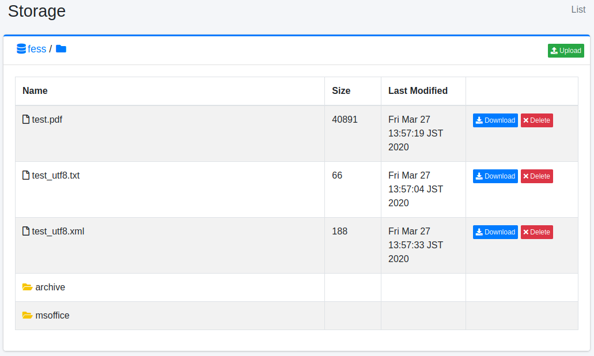

==============
Almacenamiento
==============

Descripción general
===================

La página de almacenamiento le permite administrar archivos en Amazon S3, Google Cloud Storage o almacenamiento compatible con S3 (como MinIO).

Método de gestión
==================

Configuración del servidor de almacenamiento de objetos
--------------------------------------------------------

Abra la configuración de almacenamiento desde [Sistema > General] y configure los siguientes elementos según su tipo de almacenamiento.

Configuración común
~~~~~~~~~~~~~~~~~~~

- Tipo: Tipo de almacenamiento (Automático/S3/GCS)
- Cubo: Nombre del cubo a administrar

Configuración de S3
~~~~~~~~~~~~~~~~~~~

- Punto final: Punto final de S3 (utiliza el predeterminado de AWS si está vacío)
- Clave de acceso: Clave de acceso de AWS
- Clave secreta: Clave secreta de AWS
- Región: Región de AWS

Configuración de GCS
~~~~~~~~~~~~~~~~~~~~

- Punto final: Punto final de GCS (utiliza el predeterminado de Google Cloud si está vacío)
- ID de proyecto: ID del proyecto de Google Cloud
- Ruta de credenciales: Ruta del archivo JSON de credenciales de la cuenta de servicio

Configuración de MinIO (compatible con S3)
~~~~~~~~~~~~~~~~~~~~~~~~~~~~~~~~~~~~~~~~~~

- Punto final: URL del punto final del servidor MinIO
- Clave de acceso: Clave de acceso de MinIO
- Clave secreta: Clave secreta de MinIO

Método de visualización
-----------------------

Para abrir la página de lista de objetos que se muestra a continuación, haga clic en [Sistema > Almacenamiento] en el menú izquierdo.

|image0|

Nombre
::::::

Nombre del archivo del objeto

Tamaño
::::::

Tamaño del objeto

Última modificación
:::::::::::::::::::

Última modificación del objeto

Descarga
--------

Puede descargar el objeto haciendo clic en el botón de descarga.

Eliminar
--------

Puede eliminar el objeto haciendo clic en el botón de eliminar.

Carga
-----

Puede abrir la ventana de carga de archivos haciendo clic en el botón de carga de archivos en la esquina superior derecha.

Crear carpeta
-------------

Puede abrir la ventana de creación de carpeta haciendo clic en el botón de crear carpeta a la derecha de la visualización de ruta. Tenga en cuenta que no se pueden crear carpetas vacías.

