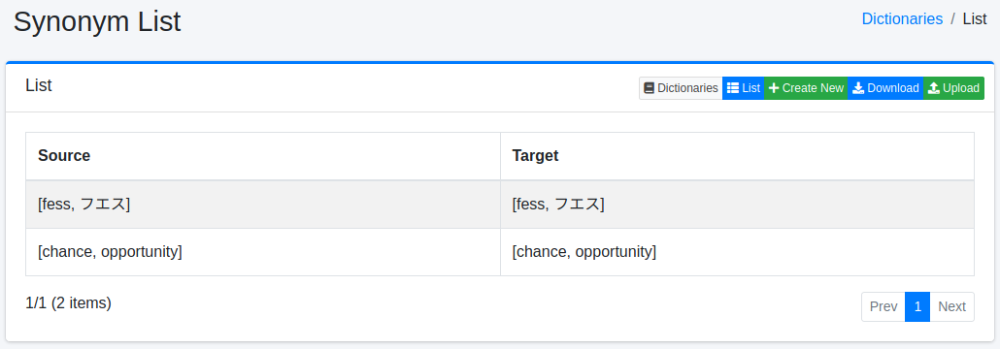
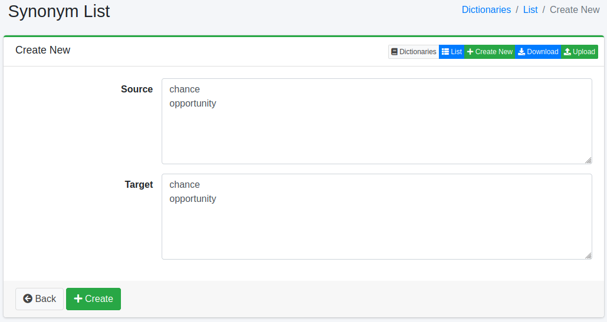

=====================
Diccionario de Sinónimos
=====================

Descripción general
===================

Los sinónimos son palabras que se escriben de forma diferente pero tienen el mismo significado (o un significado similar). Por ejemplo, "GB" y "gigabyte", "PC" y "computadora", o "TV" y "televisión" son sinónimos (palabras de significado equivalente). Si los registra en el diccionario de sinónimos de |Fess|, al buscar con una de estas palabras, los documentos que contengan las otras palabras registradas como sinónimo también se incluirán en los resultados de búsqueda. De este modo, puede evitar omisiones en la búsqueda causadas por variaciones en la escritura y aumentar la tasa de acierto de las búsquedas.

Puede administrar sinónimos de palabras con el mismo significado (GB, gigabyte, etc.).

Método de gestión
==================

Método de visualización
-----------------------

Para abrir la página de lista de configuración de sinónimos que se muestra a continuación, seleccione [Sistema > Diccionario] en el menú izquierdo y luego haga clic en synonym.

|image0|

Para editar, haga clic en el nombre de la configuración.

Método de configuración
-----------------------

Para abrir la página de configuración de sinónimos, haga clic en el botón de nueva creación.

|image1|

Parámetros de configuración
----------------------------

Dado que la configuración estándar para la creación de índices es bi-gram, es necesario registrar de manera que la palabra después de la conversión no sea de un solo carácter.
Además, al registrar sinónimos, es necesario registrar de la siguiente manera:

* Registrar hiragana en katakana
* Registrar katakana minúscula en katakana mayúscula
* Registrar caracteres alfanuméricos de ancho completo en caracteres alfanuméricos de ancho medio
* No registrar sinónimos duplicados

Origen de la conversión
:::::::::::::::::::::::

Ingrese la palabra que será objeto de tratamiento como sinónimo.

Después de la conversión
:::::::::::::::::::::::::

Expanda la palabra ingresada en el origen de la conversión con la palabra después de la conversión.
Por ejemplo, si desea tratar "TV" como "TV" y "テレビ", ingrese "TV" en el origen de la conversión e ingrese "TV" y "テレビ" en después de la conversión.

Descarga
========

Puede descargar en el formato de diccionario de sinónimos proporcionado por Apache Lucene.

Carga
=====

Puede cargar en el formato de diccionario de sinónimos proporcionado por Apache Lucene.
Dado que los sinónimos son el reemplazo de un grupo de palabras por otro grupo de palabras, en la descripción del diccionario se utilizan comas (,) y conversión (=>).
Por ejemplo, si desea reemplazar "TV" con "テレビ", use => y descríbalo de la siguiente manera:

::

    TV=>テレビ

Si desea tratar "fess" y "フェス" como lo mismo, descríbalo de la siguiente manera:

::

    fess,フエス=>fess,フエス

En casos como el anterior, también puede omitir => y describirlo de la siguiente manera:

::

    fess,フエス

Véase también
=============

- :doc:`../user/search-or` - Búsqueda OR
- :doc:`../user/search-field` - Búsqueda con especificación de campos
- :doc:`dict-guide` - Diccionario

