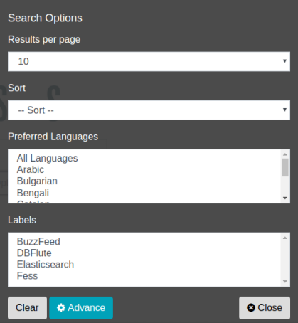

========================================
Búsqueda con especificación de etiquetas
========================================

Búsqueda con especificación de etiquetas (búsqueda por categorías)
===================================================================

Al agregar información de etiquetas para categorizar los documentos objetivo de búsqueda, es posible realizar búsquedas filtradas especificando etiquetas en el momento de la búsqueda. Si utiliza etiquetas, puede limitar el ámbito de búsqueda, por ejemplo, por departamento, sitio o tipo de documento.

La información de etiquetas se puede registrar en la pantalla de administración, lo que permite buscar por etiquetas en la pantalla de búsqueda. La información de etiquetas disponible se puede seleccionar mediante un menú desplegable en el momento de la búsqueda, permitiendo seleccionar varias etiquetas a la vez; si selecciona varias etiquetas, se incluirán en la búsqueda los documentos que tengan asignada cualquiera de ellas. Si no hay etiquetas registradas, el cuadro desplegable de etiquetas no se mostrará.

.. note::
    Dado que se pueden configurar permisos para las etiquetas, en el menú desplegable solo se muestran las etiquetas a las que el usuario que realiza la búsqueda tiene acceso permitido. Además, las etiquetas que se muestran pueden variar según el host virtual o la configuración regional (idioma). Por este motivo, aunque haya etiquetas registradas, es posible que no aparezcan en el menú desplegable para determinados usuarios.

Las etiquetas se definen especificando, mediante una expresión regular sobre la ruta de la URL, los documentos a los que se debe asignar la etiqueta. Para obtener información sobre cómo registrar etiquetas y sus elementos de configuración, consulte :doc:`Guía de administración de etiquetas <../admin/labeltype-guide>`.

Cómo utilizar
-------------

Puede seleccionar información de etiquetas en el momento de la búsqueda. La información de etiquetas se puede seleccionar en las opciones de búsqueda que se muestran al presionar el botón de opciones.

|image0|

Al configurar etiquetas y crear el índice, puede buscar documentos que tengan configuradas esas etiquetas. Una búsqueda sin especificar etiquetas será una búsqueda completa normal, como de costumbre.

La asignación de etiquetas a los documentos se realiza comparando la URL del documento con las rutas configuradas para la etiqueta en el momento de rastrear y crear el índice. Por este motivo, si agrega o modifica la definición de una etiqueta (las rutas incluidas o las rutas excluidas), el cambio no se aplicará automáticamente a los documentos que ya estén indexados. Para aplicar el cambio, vuelva a rastrear los documentos correspondientes o ejecute el trabajo "Label Updater" registrado en el programador para actualizar el índice.

.. pdf   :width: 300 px
