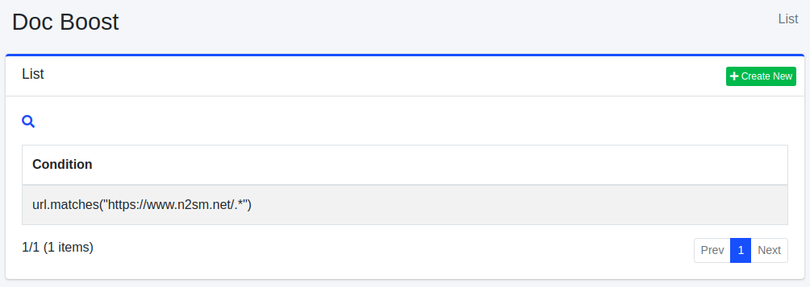
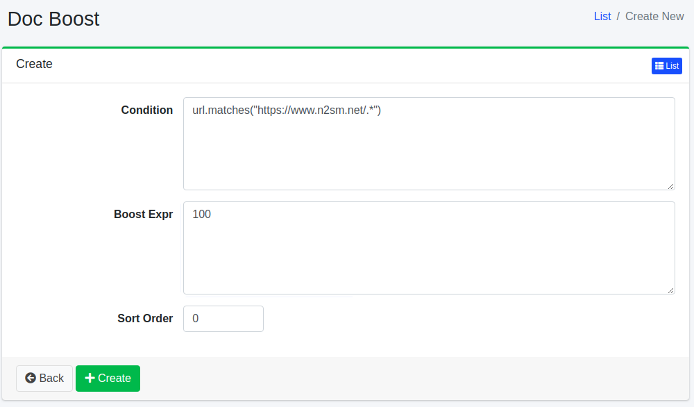

=======================
Impulso de Documento
=======================

Descripción general
===================

Aquí se explica la configuración relacionada con el impulso de documento.
Al configurar el impulso de documento, puede posicionar documentos en la parte superior de los resultados de búsqueda independientemente del término de búsqueda.

Método de gestión
==================

Método de visualización
-----------------------

Para abrir la página de lista de configuración de impulso de documento que se muestra a continuación, haga clic en [Rastreador > Impulso de documento] en el menú izquierdo.

|image0|

Para editar, haga clic en el nombre de la configuración.

Crear configuración
-------------------

Para abrir la página de configuración de impulso de documento, haga clic en el botón de nueva creación.

|image1|

Parámetros de configuración
----------------------------

Condición
:::::::::

Especifique la condición de los documentos que desea posicionar en la parte superior.
Por ejemplo, si desea mostrar en la parte superior las URL que contienen https://www.n2sm.net/, describa url.matches("https://www.n2sm.net/.\*").
Las condiciones se escriben en la sintaxis del motor de scripting especificado en «Tipo de Script» a continuación.

Expresión de impulso
::::::::::::::::::::

Especifique el valor de ponderación del documento.
Las expresiones se escriben en la sintaxis del motor de scripting especificado en «Tipo de Script» a continuación.

Tipo de Script
::::::::::::::

Especifique el motor de scripting utilizado para evaluar la condición y la expresión de impulso.
Las configuraciones nuevas se rellenan con ``javascript``. Para seleccionar ``groovy`` se requiere
el plugin ``fess-script-groovy``. Si se deja en blanco, las expresiones se evalúan como Groovy.

.. warning::

   Con JavaScript, escriba la condición y la expresión de impulso como expresiones puras sin
   punto y coma final. Un texto que solo puede analizarse como bloque de sentencias se evalúa
   como ``null`` salvo que contenga un ``return`` explícito. Consulte
   :ref:`javascript-statement-null` (en :doc:`../config/scripting-javascript`).

Orden de clasificación
:::::::::::::::::::::::

Configure el orden de clasificación del impulso de documento.

Eliminar configuración
----------------------

Haga clic en el nombre de la configuración en la página de lista y haga clic en el botón de eliminar para que aparezca una pantalla de confirmación. Al presionar el botón de eliminar, se eliminará la configuración.

