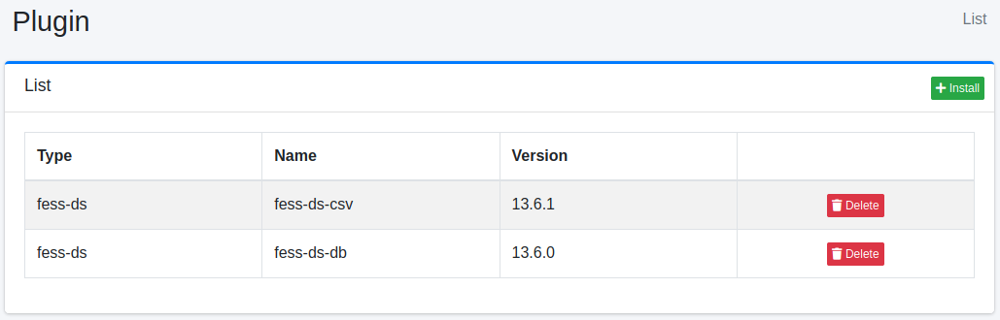
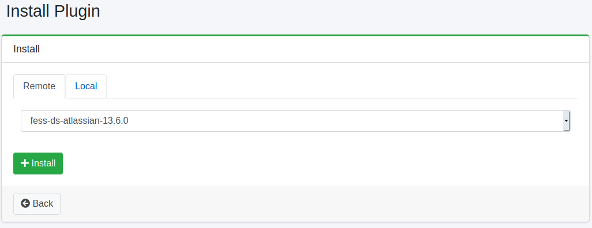

==========
Complemento
==========

Descripción general
===================

La página de configuración de complementos gestiona los complementos.

Método de gestión
==================

Método de visualización
-----------------------

Para abrir la página de lista de complementos instalados que se muestra a continuación, haga clic en [Sistema > Plugin] en el menú izquierdo.

|image0|

Para desinstalar, haga clic en el botón de eliminar.

Instalación
-----------

Para instalar un nuevo complemento, haga clic en el botón de instalación.

|image1|

Seleccione el complemento que desea instalar en el menú desplegable de la pestaña «Remoto» y haga clic en el botón de instalación para comenzar la instalación.
La lista del menú desplegable se obtiene de los repositorios de plugins (``plugin.repositories``). Si no se puede conectar con los repositorios, se muestra «No se encontraron plugins disponibles.».

Para instalar un archivo jar local, selecciónelo en «Archivo Jar» de la pestaña «Local» y haga clic en el botón de instalación. Solo se pueden indicar archivos con la extensión ``.jar``.
Deje el menú desplegable de la pestaña «Remoto» en su primera opción (``-``). Si hay otro complemento seleccionado, se instala ese en su lugar.
Para instalar en un entorno sin conexión a Internet, consulte :ref:`fess-setup-offline`.

Reinicie |Fess| después de instalar un complemento.

Instalación desde la línea de comandos
======================================

``bin/fess-setup`` instala complementos desde la línea de comandos.

::

    $ bin/fess-setup install plugin fess-script-groovy

Sin una versión, se selecciona del repositorio la más reciente compilada para este |Fess|, por lo que cada ejecución puede instalar una versión distinta. Para fijarla, escriba la versión después del nombre del complemento, separada por dos puntos.

::

    $ bin/fess-setup install plugin fess-script-groovy:15.9.0 fess-ds-git:15.9.0

Los complementos se publican por separado, así que los que se instalan juntos no están necesariamente en la misma versión. Indique la versión de cada uno. Un complemento indicado sin versión usa el valor de ``--version``.

::

    $ bin/fess-setup install plugin fess-script-groovy fess-ds-git:15.9.1 --version 15.9.0

La versión instalada anteriormente de un complemento se elimina una vez instalada la nueva. Una versión que no existe termina con el código de salida 1, de modo que un paso de compilación como un Dockerfile falla en lugar de continuar sin el complemento.

``bin/fess-setup list plugins`` muestra los complementos publicados para este |Fess| y cuáles de ellos están instalados, ``list installed`` muestra los complementos instalados sin consultar el repositorio, ``upgrade plugins`` vuelve a instalar cada complemento instalado en la versión adecuada para este |Fess| y ``remove plugin`` elimina un complemento. Reinicie |Fess| después de instalar, actualizar o eliminar complementos. Consulte :doc:`../install/fess-setup` para ver todos los comandos y opciones.

