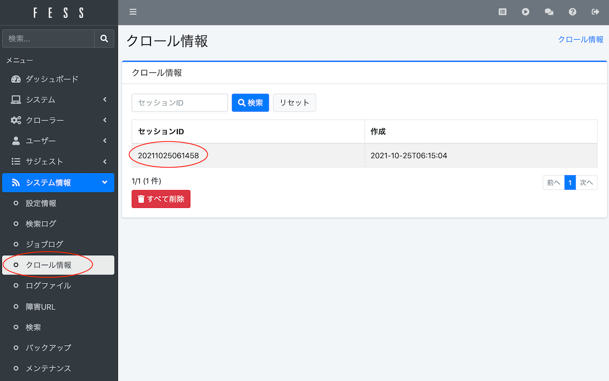

===============================================
Creación de un Entorno de Búsqueda Empresarial con Fess ~ Edición de Introducción
===============================================

Introducción
========

Los documentos que se gestionan aumentan día a día, y se requiere que estos documentos se gestionen de manera eficiente y se utilicen como conocimiento.
Cuanto más aumentan los documentos a gestionar, más difícil se vuelve encontrar aquellos que contengan información específica.
Como solución a esto, se puede mencionar la introducción de un servidor de búsqueda de texto completo que pueda buscar en enormes cantidades de información.

Fess es un servidor de búsqueda de texto completo de código abierto basado en Java que es fácil de introducir.
Fess utiliza Elasticsearch en su parte de motor de búsqueda.
Elasticsearch es un motor de búsqueda de alta funcionalidad con un diseño escalable y flexible basado en Lucene.
Por otro lado, cuando se intenta construir un sistema de búsqueda de texto completo con Elasticsearch, es necesario implementar por uno mismo diversas funciones como la parte del rastreador.
En Fess, se utiliza Fess Crawler en la parte del rastreador para recopilar varios tipos de documentos en la web y el sistema de archivos y hacerlos objeto de búsqueda.

Por lo tanto, este artículo presenta la construcción de un servidor de búsqueda con Fess.

Lectores Objetivo
========

-  Personas que desean construir un sistema de búsqueda empresarial/sistema de búsqueda

-  Personas que desean agregar funcionalidad de búsqueda a sistemas existentes

- Personas que desean realizar búsqueda interna y crear un entorno donde se pueda utilizar el conocimiento

-  Personas interesadas en software de búsqueda como Lucene o Elasticsearch

Entorno Necesario
==========

El contenido de este artículo ha sido verificado en el siguiente entorno.

-  Ubuntu 22.04

-  OpenJDK 21

¿Qué es Fess?
=========

Fess es un sistema de búsqueda de texto completo de código abierto orientado a la web y sistemas de archivos.
Se proporciona bajo licencia Apache desde el `sitio de Fess <https://fess.codelibs.org/ja/>`__ en el proyecto CodeLibs de GitHub.

Características de Fess
-----------

Sistema de Búsqueda Basado en Java
~~~~~~~~~~~~~~~~~~~~~~~~~

Fess se construye utilizando varios productos de código abierto.

Los distribuibles se proporcionan como aplicaciones ejecutables.
Fess proporciona pantallas de búsqueda y administración.
Fess adopta LastaFlute como framework web.
Por lo tanto, cuando es necesaria la personalización de pantallas, es posible personalizarlas fácilmente modificando JSP.
Además, los datos de configuración y rastreo se almacenan en OpenSearch, y el acceso a estos datos se realiza utilizando el mapeador O/R DBFlute.

Dado que Fess se construye como un sistema basado en Java, puede ejecutarse en todas las plataformas donde Java pueda funcionar.
También cuenta con una interfaz de usuario que permite configurar fácilmente diversas opciones desde un navegador web.

Uso de OpenSearch como Motor de Búsqueda
~~~~~~~~~~~~~~~~~~~~~~~~~~~~~~~~~~~~

OpenSearch es un motor de búsqueda y análisis de código abierto basado en Lucene proporcionado por AWS.
Entre sus características se incluyen el soporte para búsqueda en tiempo real, resaltado de resultados de búsqueda y funciones de agregación.
Además, el número de documentos que se pueden hacer objeto de búsqueda puede llegar a cientos de millones dependiendo de la configuración del servidor OpenSearch, siendo un servidor de búsqueda que puede escalar a sitios de gran escala.
También hay muchos casos de uso en Japón, y se puede decir que es uno de los motores de búsqueda que está recibiendo atención.

En Fess, se adopta OpenSearch en la parte del motor de búsqueda.
La versión Docker de Fess se distribuye con OpenSearch integrado, pero también es posible usarlo separándolo en un servidor diferente del servidor Fess.
Además, se puede configurar redundancia tanto para Fess como para OpenSearch, lo que permite aprovechar una alta escalabilidad.

Uso de Fess Crawler como Motor de Rastreo
~~~~~~~~~~~~~~~~~~~~~~~~~~~~~~~~~~~~~~~~~

Fess Crawler es un framework de rastreo proporcionado por el proyecto CodeLibs.
Fess Crawler puede navegar y recopilar documentos en la web y en el sistema de archivos.
La recopilación de documentos también puede procesar múltiples documentos simultáneamente de manera eficiente con multihilo.
Además, los documentos que puede manejar incluyen no solo HTML, sino también archivos de MS Office como Word y Excel, archivos comprimidos como zip, archivos de imagen y audio, entre otros, admitiendo numerosos formatos (en el caso de archivos de imagen y audio, obtiene metainformación).

En Fess se utiliza Fess Crawler para navegar por documentos en la web y el sistema de archivos y recopilar información de texto.
Los formatos de archivo compatibles también pueden ser objeto de búsqueda si Fess Crawler puede manejarlos.
Los parámetros para ejecutar el rastreo con Fess Crawler se pueden configurar desde la interfaz de administración de Fess.

Instalación e Inicio
==================

Aquí se explican los pasos para iniciar Fess y realizar búsquedas.
La explicación se hace asumiendo la ejecución en Ubuntu 22.04, pero la instalación e inicio se pueden realizar con pasos casi idénticos en macOS y Windows.

Descarga e Instalación
--------------------------

Descarga de Fess
^^^^^^^^^^^^^^^^^^^

Descargue el paquete más reciente desde https://github.com/codelibs/fess/releases.
En el momento de escribir este artículo (2025/11), la última versión es 15.3.0.
Después de completar la descarga, descomprima en un directorio arbitrario.

Descarga de Fess
|image1|

Descarga de OpenSearch
^^^^^^^^^^^^^^^^^^^^^^^^^

Descargue desde la `página de descarga de OpenSearch <https://opensearch.org/downloads.html>`__.
En la página de descarga de Fess se indica la versión de OpenSearch correspondiente a cada versión, así que verifique la versión antes de descargar.
La versión correspondiente a Fess 15.3.0 es 3.3.0, así que descargue esta versión.
Después de completar la descarga, descomprima en un directorio arbitrario.

Configuración
----

Antes de iniciar, configure Fess para conectarse al clúster de OpenSearch.
Para el método de configuración de paquetes ZIP/TAR.GZ, consulte el `método de instalación <https://fess.codelibs.org/ja/15.3/install/install.html>`__ en la página de instalación.
Si el paquete que utiliza es RPM/DEB, consulte también la misma página de instalación.

Inicio
----

El inicio es sencillo. Ejecute los siguientes comandos en los directorios expandidos opensearch-<version> y fess-<version>.
Inicie en el orden OpenSearch → Fess.

Inicio de OpenSearch
::

    $ ./bin/opensearch

Inicio de Fess
::

    $ ./bin/fess

Acceda a http://localhost:8080/ con un navegador, y si se muestra una pantalla como la siguiente, está iniciado.

Pantalla principal de búsqueda
|image2|

Detención
----

Para detener el servidor Fess, detenga (kill) el proceso de Fess.
Al detener, hágalo en el orden Fess → OpenSearch.

Estructura de Directorios
----------------

La estructura de directorios es la siguiente.

Estructura de directorios de Fess
::

    fess-15.3.0
    ├── LICENSE
    ├── README.md
    ├── app
    │   ├── META-INF
    │   ├── WEB-INF
    │   │   ├── cachedirs
    │   │   ├── classes
    │   │   ├── conf
    │   │   ├── env
    │   │   ├── fe.tld
    │   │   ├── lib
    │   │   ├── logs
    │   │   ├── orig
    │   │   ├── plugin
    │   │   ├── project.properties
    │   │   ├── site
    │   │   ├── thumbnails
    │   │   ├── view
    │   ├── css
    │   │   ├── admin
    │   │   ├── fonts
    │   │   └── style.css
    │   ├── favicon.ico
    │   ├── images
    │   └── js
    ├── bin
    ├── extension
    ├── lib
    ├── logs
    └── temp

Fess se basa en TomcatBoot proporcionado por LastaFlute.
Los archivos del grupo de aplicaciones de Fess se colocan bajo el directorio app.
Aunque también es posible editar desde la pantalla de administración, los JSP de la pantalla de búsqueda se guardan bajo app/WEB-INF/view.
Además, js, css e images directamente bajo el directorio app son los archivos utilizados en la pantalla de búsqueda.

Estructura de directorios de OpenSearch
::

    opensearch-3.3.0
    ├── LICENSE.txt
    ├── NOTICE.txt
    ├── README.md
    ├── bin
    ├── config
    │   ├── opensearch.yml
    │   ├── jvm.options
    │   ├── jvm.options.d
    │   ├── log4j2.properties
    │   └── ...
    ├── data
    ├── lib
    ├── logs
    ├── modules
    └── plugins

Los datos del índice se guardan en el directorio data.

Desde la Creación del Índice hasta la Búsqueda
==============================

En el estado inmediatamente después del inicio, no se ha creado un índice para buscar, por lo que no se devuelven resultados incluso si se busca.
Por lo tanto, primero es necesario crear un índice. Aquí se explica como ejemplo desde la creación de un índice hasta realizar búsquedas tomando como objetivo https://fess.codelibs.org/ja/ y siguientes.

Inicio de Sesión en la Página de Administración
----------------------

Primero, acceda a la página de administración en http://localhost:8080/admin e inicie sesión.
Por defecto, tanto el nombre de usuario como la contraseña son admin.

Inicio de sesión en la página de administración
|image3|

Registro de Objetivos de Rastreo
------------------

A continuación, registre los objetivos de rastreo. Dado que esta vez el objetivo son páginas web, seleccione [Web] en el lado izquierdo de la página de administración.
En el estado inicial no hay nada registrado, así que seleccione [Crear nuevo].

Seleccionar [Crear nuevo]
|image4|

Como configuración de rastreo web, esta vez rastrearemos el grupo de páginas bajo https://fess.codelibs.org/ja/ con 2 hilos a intervalos de 10 segundos (aproximadamente 2 páginas cada 10 segundos), y haremos que aproximadamente 100 páginas sean objeto de búsqueda.
Los elementos de configuración son URL: \https://fess.codelibs.org/ja/, URL a rastrear: \https://fess.codelibs.org/ja/.*, Número máximo de accesos: 100, Número de hilos: 2, Intervalo: 10000 milisegundos, y los demás valores predeterminados.

Configuración de rastreo web
|image5|

Haciendo clic en [Crear], puede registrar los objetivos de rastreo.
El contenido registrado se puede cambiar presionando cada configuración.

Registro completo de configuración de rastreo web
|image6|

Iniciar el Rastreo
------------------

A continuación, seleccione Sistema > Programador > Default Crawler y presione [Iniciar ahora].

Selección del programador
|image7|

Se puede verificar si el rastreo ha comenzado y si se está creando el índice desde Información del sistema > Información de rastreo.
Si el rastreo se ha completado, se muestra el número de documentos que se hicieron objeto de búsqueda en el tamaño del índice (Web/Archivo) de [Información de rastreo].

Verificación del estado del rastreo
|image8|

Ejemplo cuando el rastreo se ha completado
|image9|

Ejemplo de Ejecución de Búsqueda
----------

Después de completar el rastreo, al buscar se devuelven resultados como los de la imagen a continuación.

Ejemplo de búsqueda
|image10|

Personalización de la Pantalla de Búsqueda
======================

Aquí se presenta cómo personalizar la pantalla principal de búsqueda y la pantalla de lista de resultados de búsqueda, que son las que los usuarios más ven.

Esta vez se muestra el método para cambiar el nombre del archivo de logo.
Si desea cambiar el diseño en sí, dado que está descrito en archivos JSP simples, puede cambiarlo si tiene conocimientos de HTML.

Primero, la pantalla principal de búsqueda es el archivo "app/WEB-INF/view/index.jsp".

Parte del archivo JSP de la pantalla principal de búsqueda
::

    <la:form action="/search" method="get" styleId="searchForm">
      ${fe:facetForm()}${fe:geoForm()}
      ・
      ・
      ・
      <main class="container">
        

          

            <h1 class="mainLogo">
              " />
            </h1>
            
${notification}

            

              <la:info id="msg" message="true">
                
${msg}

              </la:info>
              <la:errors header="errors.front_header"
                footer="errors.front_footer" prefix="errors.front_prefix"
                suffix="errors.front_suffix" />
            

Si desea cambiar la imagen que se muestra en la pantalla principal de búsqueda, cambie la parte "logo.png" anterior al nombre del archivo que desea reemplazar.
Coloque el archivo en "app/images".

<la:form> y <la:message> son etiquetas JSP.
Por ejemplo, <s:form> se convierte en una etiqueta form al mostrarse en HTML real.
Para una explicación detallada, consulte el sitio de LastaFlute o sitios sobre JSP.

A continuación, la parte del encabezado de la pantalla de lista de resultados de búsqueda es el archivo "app/WEB-INF/view/header.jsp".

Parte del archivo JSP del encabezado
::

				<la:link styleClass="navbar-brand d-inline-flex" href="/">
					"
						class="align-items-center" />
				</la:link>

Si desea cambiar la imagen que se muestra en la parte superior de la pantalla de lista de resultados de búsqueda, cambie el nombre del archivo en la parte "logo-head.png" anterior.
Coloque en "app/images" de manera similar al caso de "logo.png".

Además, estas configuraciones también se pueden establecer desde Sistema > Diseño de página.

Si desea cambiar el archivo CSS utilizado en el archivo JSP, edite "style.css" ubicado en "app/css".

Resumen
======

Se ha explicado sobre Fess, que es un sistema de búsqueda de texto completo, desde la instalación hasta la búsqueda y métodos simples de personalización.
Creo que hemos podido presentar que se puede construir fácilmente un sistema de búsqueda si hay un entorno de ejecución Java, sin necesidad de construcción de entorno especial.
También se puede introducir en casos donde se desea agregar funcionalidad de búsqueda en el sitio a sistemas existentes, así que por favor pruébelo.

Material de Referencia
========

-  `Fess <https://fess.codelibs.org/ja/>`__

-  `OpenSearch <https://opensearch.org/>`__

-  `LastaFlute <https://lastaflute.dbflute.org/>`__
.. |image1| image:: ../../resources/images/ja/article/1/fess-download.png
.. |image2| image:: ../../resources/images/ja/article/1/top.png
.. |image3| image:: ../../resources/images/ja/article/1/login.png
.. |image4| image:: ../../resources/images/ja/article/1/web-crawl-conf-1.png
.. |image5| image:: ../../resources/images/ja/article/1/web-crawl-conf-2.png
.. |image6| image:: ../../resources/images/ja/article/1/web-crawl-conf-3.png
.. |image7| image:: ../../resources/images/ja/article/1/scheduler.png

.. |image9| image:: ../../resources/images/ja/article/1/session-info-2.png
.. |image10| image:: ../../resources/images/ja/article/1/search-result.png
