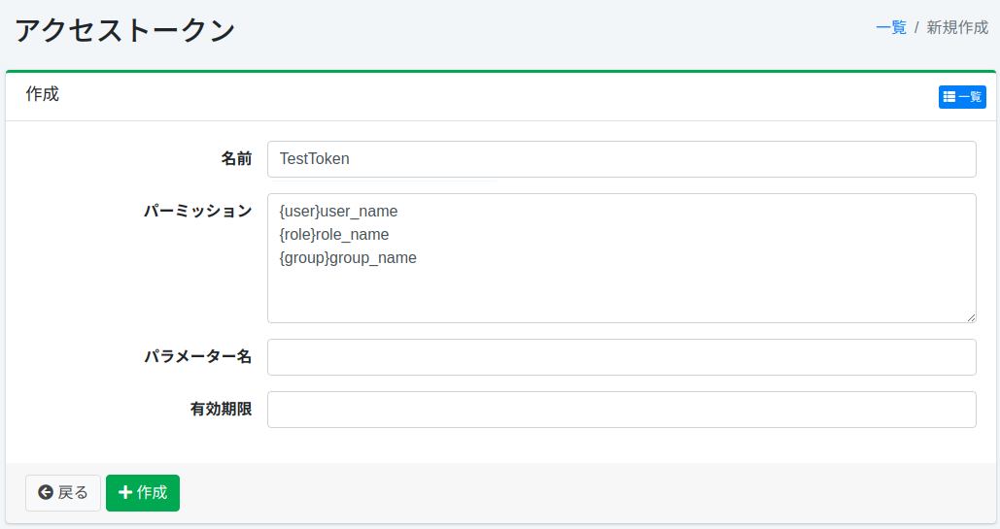
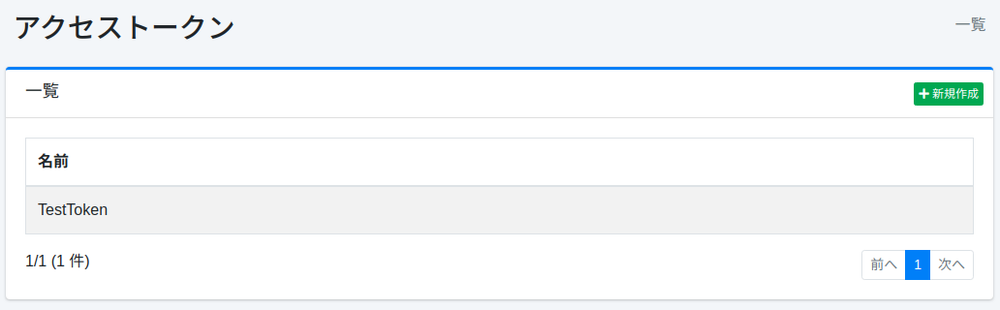

==================
Jeton d'accès
==================

Présentation
============

La page de configuration des jetons d'accès gère les jetons d'accès.

Gestion
=======

Affichage
---------

Pour ouvrir la page de liste de configuration des jetons d'accès illustrée ci-dessous, cliquez sur [Système > Jeton d'accès] dans le menu de gauche.

|image0|

Cliquez sur le nom de la configuration pour la modifier.

Création de configuration
--------------------------

Cliquez sur le bouton Nouvelle création pour ouvrir la page de configuration des jetons d'accès.

|image1|

Paramètres de configuration
----------------------------

Nom
::::

Spécifiez un nom pour décrire ce jeton d'accès.

Permission
::::::::::

Configure la permission du jeton d'accès.
Décrivez au format « {user|group|role}nom ».
Par exemple, pour qu'un utilisateur appartenant au groupe developer affiche les résultats de recherche, configurez la permission « {group}developer ».

Nom du paramètre
::::::::::::::::

Spécifiez le nom du paramètre de requête pour spécifier la permission comme requête de recherche.

Date d'expiration
:::::::::::::::::

Spécifie la date d'expiration du jeton d'accès.

Suppression de configuration
-----------------------------

Cliquez sur le nom de la configuration dans la page de liste, puis cliquez sur le bouton Supprimer pour afficher l'écran de confirmation.
Appuyer sur le bouton Supprimer supprimera la configuration.

