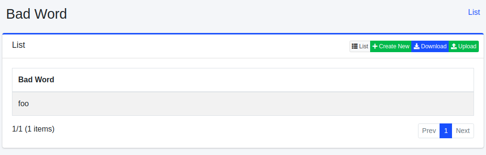
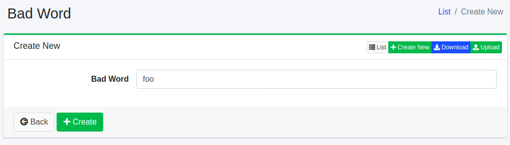
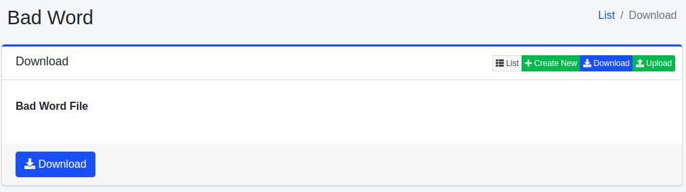
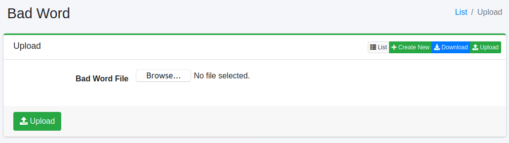

==============
Mots exclus
==============

Présentation
============

Cette section explique la configuration des mots exclus des suggestions.
Les suggestions sont affichées en fonction des termes de recherche, mais vous pouvez configurer ces mots pour qu'ils ne soient pas affichés dans les suggestions.

Gestion
=======

Affichage
---------

Pour ouvrir la page de liste de configuration des mots exclus des suggestions illustrée ci-dessous, cliquez sur [Suggestion > Mots exclus] dans le menu de gauche.

|image0|

Cliquez sur le nom de la configuration pour la modifier.

Création de configuration
--------------------------

Pour ouvrir la page de création de mots exclus des suggestions, cliquez sur le bouton Nouvelle création.

|image1|

Paramètres de configuration
----------------------------

Candidat de suggestion
::::::::::::::::::::::

Enregistre les mots NG.
Les mots enregistrés ici ne seront plus affichés dans les suggestions.

Suppression de configuration
-----------------------------

Cliquez sur le nom de la configuration dans la page de liste, puis cliquez sur le bouton Supprimer pour afficher l'écran de confirmation.
Appuyer sur le bouton Supprimer supprimera la configuration.

Téléchargement
==============

Télécharge les mots enregistrés au format CSV.

|image2|

Contenu du CSV
--------------

La première ligne est l'en-tête.
Les mots exclus sont listés à partir de la deuxième ligne.

::

"BadWord"
"検索エンジン"

Téléversement
=============

Enregistre les mots au format CSV.

|image3|

Contenu du CSV
--------------

La première ligne est l'en-tête.
Décrivez les mots exclus à partir de la deuxième ligne.

::

"BadWord"
"検索エンジン"

