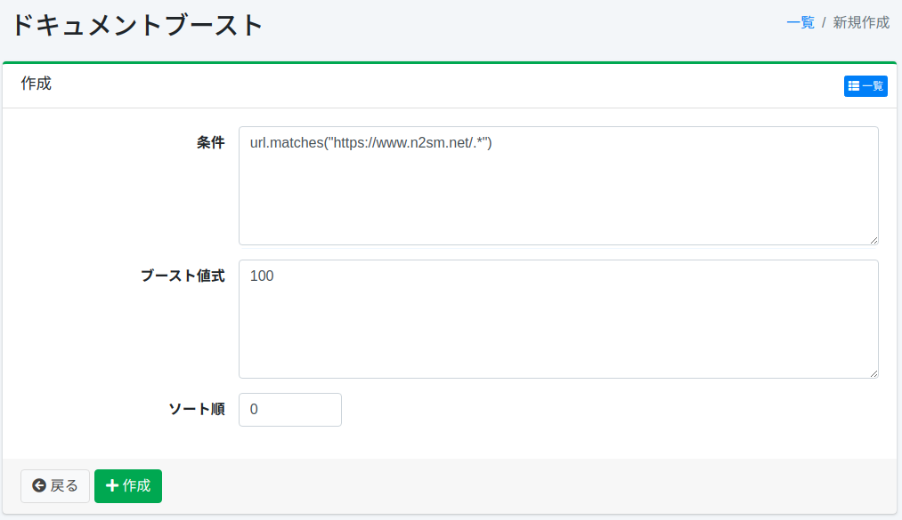

=====================
Boost de document
=====================

Présentation
============

Cette section explique la configuration du boost de document.
En configurant le boost de document, vous pouvez positionner des documents en haut des résultats de recherche indépendamment du terme de recherche.

Gestion
=======

Affichage
---------

Pour ouvrir la page de liste de configuration du boost de document illustrée ci-dessous, cliquez sur [Crawler > Boost de document] dans le menu de gauche.

|image0|

Cliquez sur le nom de la configuration pour la modifier.

Création de configuration
--------------------------

Cliquez sur le bouton Nouvelle création pour ouvrir la page de configuration du boost de document.

|image1|

Paramètres de configuration
----------------------------

Condition
:::::::::

Spécifie la condition des documents que vous souhaitez positionner en haut.
Par exemple, pour afficher en haut les URL contenant https://www.n2sm.net/, décrivez url.matches("https://www.n2sm.net/.*").
Les conditions peuvent être écrites en Groovy.

Expression de valeur de boost
::::::::::::::::::::::::::::::

Spécifie la valeur de pondération du document.
L'expression peut être écrite en Groovy.

Ordre de tri
::::::::::::

Configure l'ordre de tri du boost de document.

Suppression de configuration
-----------------------------

Cliquez sur le nom de la configuration dans la page de liste, puis cliquez sur le bouton Supprimer pour afficher l'écran de confirmation. Appuyer sur le bouton Supprimer supprimera la configuration.

.. |image0| image:: ../../../resources/images/ja/15.3/admin/boostdoc-1.png

