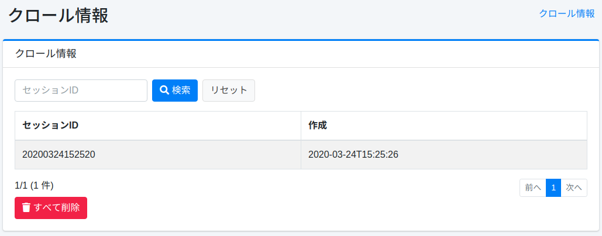
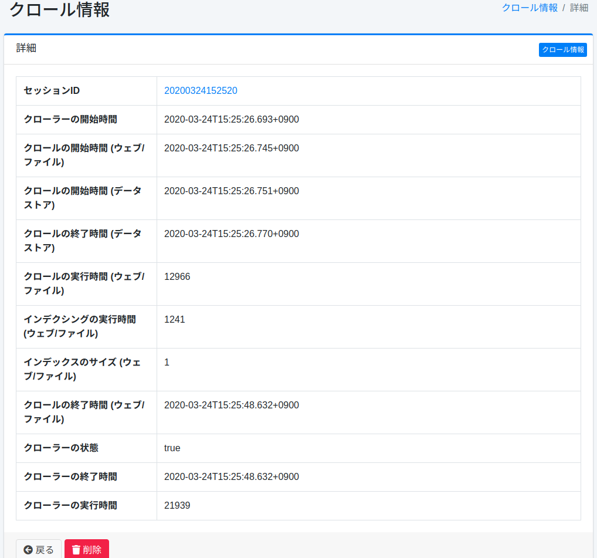

=====================
Informations de crawl
=====================

Présentation
============

Les résultats d'exécution du crawl sont enregistrés et les informations de crawl peuvent être vérifiées dans cet écran d'administration.

Gestion
=======

Liste
=====

Chaque fois qu'un crawl est exécuté, il est enregistré comme informations de crawl.
Dans la liste, vous pouvez vérifier le nom de session du crawl exécuté et l'heure d'exécution.
Si vous souhaitez vérifier les détails des informations de crawl, cliquez sur les informations de crawl cibles.

|image0|

Détails
=======

En cliquant sur l'ID de session des informations de crawl dans la liste, les détails des informations de crawl cibles s'affichent.

|image1|

Liste des éléments
------------------

ID de session
:::::::::::::

ID de session lors de l'exécution du crawl.

Heure de début du crawler
::::::::::::::::::::::::::

Heure de début de l'ensemble du crawl.

Heure de début du crawl (Web/Fichier)
::::::::::::::::::::::::::::::::::::::

Heure de début du crawl Web et du système de fichiers.

Heure de début du crawl (Magasin de données)
:::::::::::::::::::::::::::::::::::::::::::::

Heure de début du crawl du magasin de données.

Heure de fin du crawl (Web/Fichier)
::::::::::::::::::::::::::::::::::::

Heure de fin du crawl Web et du système de fichiers.

Durée d'exécution du crawl (Magasin de données)
::::::::::::::::::::::::::::::::::::::::::::::::

Durée d'exécution du crawl du magasin de données (en millisecondes).

Durée d'exécution de l'indexation (Magasin de données)
:::::::::::::::::::::::::::::::::::::::::::::::::::::::

Temps nécessaire pour indexer les résultats du crawl Web et du système de fichiers (en millisecondes).

Taille de l'index (Magasin de données)
:::::::::::::::::::::::::::::::::::::::

Nombre de documents indexés.

Heure de fin du crawl (Magasin de données)
:::::::::::::::::::::::::::::::::::::::::::

Heure de fin du crawl du magasin de données.

État du crawler
:::::::::::::::

Si le crawl a réussi ou non.

Heure de fin du crawler
::::::::::::::::::::::::

Heure de fin de l'ensemble du crawl.

Durée d'exécution du crawler
:::::::::::::::::::::::::::::

Durée d'exécution de l'ensemble du crawl (en millisecondes).

