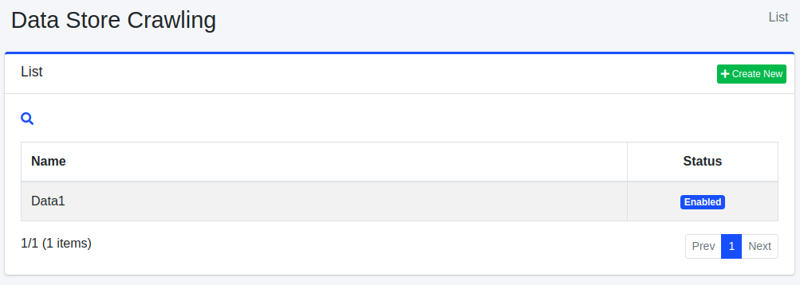

=======================
Crawl de magasin de données
===========================

Présentation
============

Dans |Fess|, vous pouvez cibler des sources de données telles que des bases de données ou des fichiers CSV pour le crawl.
Cette section explique la configuration du magasin de données nécessaire à cet effet.

Gestion
=======

Affichage
---------

Pour ouvrir la page de liste pour configurer le magasin de données illustrée ci-dessous, cliquez sur [Crawler > Magasin de données] dans le menu de gauche.

|image0|

Cliquez sur le nom de la configuration pour la modifier.

Création de configuration
-------------------------

Cliquez sur le bouton Nouvelle création pour ouvrir la page de configuration du magasin de données.

|image1|

Paramètres de configuration
---------------------------

Nom
::::

Spécifie le nom de la configuration de crawl.

Nom du gestionnaire
:::::::::::::::::::

Nom du gestionnaire qui traite le magasin de données.

* DatabaseDataStore : Crawler une base de données
* CsvDataStore : Crawler des fichiers CSV/TSV cibles
* CsvListDataStore : Crawler un fichier CSV décrivant les chemins de fichiers cibles d'indexation

Paramètres
::::::::::

Spécifie les paramètres relatifs au magasin de données.

Script
::::::

Spécifie dans quel champ définir les valeurs obtenues du magasin de données.
Les expressions peuvent être écrites en Groovy.

Valeur de boost
:::::::::::::::

Spécifie la valeur de boost des documents lors du crawl avec cette configuration.

Permission
::::::::::

Spécifie la permission pour cette configuration.
Pour la méthode de spécification de permission, par exemple, pour afficher les résultats de recherche aux utilisateurs appartenant au groupe developer, spécifiez {group}developer.
La spécification par utilisateur est {user}nom_utilisateur, par rôle {role}nom_rôle, par groupe {group}nom_groupe.

Hôte virtuel
::::::::::::

Spécifie le nom d'hôte de l'hôte virtuel.
Pour plus de détails, consultez :doc:`Configuration de l'hôte virtuel dans le guide de configuration <../config/virtual-host>`.

État
::::

Spécifie si cette configuration de crawl doit être utilisée.

Description
:::::::::::

Vous pouvez saisir une description.

Suppression de configuration
----------------------------

Cliquez sur le nom de la configuration dans la page de liste, puis cliquez sur le bouton Supprimer pour afficher l'écran de confirmation.
Appuyer sur le bouton Supprimer supprimera la configuration.

Exemples
========

DatabaseDataStore
-----------------

Explication du crawl de base de données.

À titre d'exemple, supposons qu'il y ait une table comme suit dans une base de données appelée testdb dans MySQL, et qu'elle puisse être connectée avec le nom d'utilisateur hoge et le mot de passe fuga.

::

    CREATE TABLE doc (
        id BIGINT NOT NULL AUTO_INCREMENT,
        title VARCHAR(100) NOT NULL,
        content VARCHAR(255) NOT NULL,
        latitude VARCHAR(20),
        longitude VARCHAR(20),
        versionNo INTEGER NOT NULL,
        PRIMARY KEY (id)
    );

Ici, les données suivantes sont insérées.

::

    INSERT INTO doc (title, content, latitude, longitude, versionNo) VALUES ('タイトル 1', 'コンテンツ 1 です．', '37.77493', ' -122.419416', 1);
    INSERT INTO doc (title, content, latitude, longitude, versionNo) VALUES ('タイトル 2', 'コンテンツ 2 です．', '34.701909', '135.494977', 1);
    INSERT INTO doc (title, content, latitude, longitude, versionNo) VALUES ('タイトル 3', 'コンテンツ 3 です．', '-33.868901', '151.207091', 1);
    INSERT INTO doc (title, content, latitude, longitude, versionNo) VALUES ('タイトル 4', 'コンテンツ 4 です．', '51.500152', '-0.113736', 1);
    INSERT INTO doc (title, content, latitude, longitude, versionNo) VALUES ('タイトル 5', 'コンテンツ 5 です．', '35.681137', '139.766084', 1);

Paramètres
::::::::::

Un exemple de configuration des paramètres est le suivant.

::

    driver=com.mysql.jdbc.Driver
    url=jdbc:mysql://localhost:3306/testdb?useUnicode=true&characterEncoding=UTF-8
    username=hoge
    password=fuga
    sql=select * from doc

Les paramètres sont au format « clé=valeur ». La description des clés est la suivante.

.. tabularcolumns:: |p{4cm}|p{8cm}|
.. list-table::

   * - driver
     - Nom de la classe du pilote
   * - url
     - URL
   * - username
     - Nom d'utilisateur pour se connecter à la DB
   * - password
     - Mot de passe pour se connecter à la DB
   * - sql
     - Instruction SQL pour obtenir les cibles de crawl

Tableau : Exemple de paramètres de configuration pour DB

Script
::::::

Un exemple de configuration du script est le suivant.

::

    url="http://SERVERNAME/" + id
    host="SERVERNAME"
    site="SERVERNAME"
    title=title
    content=content
    cache=content
    digest=content
    anchor=
    content_length=content.length()
    last_modified=new java.util.Date()
    location=latitude + "," + longitude
    latitude=latitude
    longitude=longitude

Les paramètres sont au format « clé=valeur ». La description des clés est la suivante.

Le côté valeur est écrit en Groovy.
Les chaînes doivent être fermées par des guillemets doubles. En accédant par le nom de colonne de la base de données, vous obtenez cette valeur.

.. tabularcolumns:: |p{4cm}|p{8cm}|
.. list-table::

   * - url
     - URL (configurez une URL accessible aux données selon votre environnement)
   * - host
     - Nom d'hôte
   * - site
     - Chemin du site
   * - title
     - Titre
   * - content
     - Contenu du document (chaîne cible d'indexation)
   * - cache
     - Cache du document (non cible d'indexation)
   * - digest
     - Partie digest affichée dans les résultats de recherche
   * - anchor
     - Liens contenus dans le document (généralement pas besoin de spécifier)
   * - content_length
     - Longueur du document
   * - last_modified
     - Date de dernière modification du document

Tableau : Contenu de la configuration du script

Pilote
::::::

Un pilote est nécessaire pour se connecter à la base de données. Placez le fichier jar dans app/WEB-INF/lib.

CsvDataStore
------------

Explication du crawl ciblant les fichiers CSV.

Par exemple, créez le fichier test.csv dans le répertoire /home/taro/csv avec le contenu suivant.
L'encodage du fichier est Shift_JIS.

::

    1,タイトル 1,テスト1です。
    2,タイトル 2,テスト2です。
    3,タイトル 3,テスト3です。
    4,タイトル 4,テスト4です。
    5,タイトル 5,テスト5です。
    6,タイトル 6,テスト6です。
    7,タイトル 7,テスト7です。
    8,タイトル 8,テスト8です。
    9,タイトル 9,テスト9です。

Paramètres
::::::::::

Un exemple de configuration des paramètres est le suivant.

::

    directories=/home/taro/csv
    fileEncoding=Shift_JIS

Les paramètres sont au format « clé=valeur ». La description des clés est la suivante.

.. tabularcolumns:: |p{4cm}|p{8cm}|
.. list-table::

   * - directories
     - Répertoire contenant les fichiers CSV (.csv ou .tsv)
   * - files
     - Fichier CSV (en cas de spécification directe)
   * - fileEncoding
     - Encodage du fichier CSV
   * - separatorCharacter
     - Caractère de séparation

Tableau : Exemple de paramètres de configuration pour fichiers CSV

Script
::::::

Un exemple de configuration du script est le suivant.

::

    url="http://SERVERNAME/" + cell1
    host="SERVERNAME"
    site="SERVERNAME"
    title=cell2
    content=cell3
    cache=cell3
    digest=cell3
    anchor=
    content_length=cell3.length()
    last_modified=new java.util.Date()

Les paramètres sont au format « clé=valeur ».
Les clés sont les mêmes que pour le crawl de base de données.
Les données dans le fichier CSV sont conservées dans cell[nombre] (le nombre commence à 1).
Si aucune donnée n'existe dans la cellule du fichier CSV, elle peut être null.

EsDataStore
-----------

La source d'obtention des données est elasticsearch, mais l'utilisation de base est la même que CsvDataStore.

Paramètres
::::::::::

Un exemple de configuration des paramètres est le suivant.

::

    settings.cluster.name=elasticsearch
    hosts=SERVERNAME:9300
    index=logindex
    type=data

Les paramètres sont au format « clé=valeur ». La description des clés est la suivante.

.. tabularcolumns:: |p{4cm}|p{8cm}|
.. list-table::

   * - settings.*
     - Informations de paramètres d'elasticsearch
   * - hosts
     - Elasticsearch de destination de connexion
   * - index
     - Nom de l'index
   * - type
     - Nom du type
   * - query
     - Requête de condition pour obtenir

Tableau : Exemple de paramètres de configuration pour elasticsearch

Script
::::::

Un exemple de configuration du script est le suivant.

::

    url=source.url
    host="SERVERNAME"
    site="SERVERNAME"
    title=source.title
    content=source.content
    digest=
    anchor=
    content_length=source.size
    last_modified=new java.util.Date()

Les paramètres sont au format « clé=valeur ».
Les clés sont les mêmes que pour le crawl de base de données.
Vous pouvez obtenir et configurer les valeurs avec source.*.

CsvListDataStore
----------------

Utilisé pour crawler un grand nombre de fichiers.
En plaçant un fichier CSV contenant les chemins des fichiers mis à jour et en ne crawlant que les chemins spécifiés, vous pouvez réduire le temps d'exécution du crawl.

Le format pour décrire les chemins est le suivant.

::

    [action]<caractère de séparation>[chemin]

Pour l'action, spécifiez l'un des suivants :

* create : Le fichier a été créé
* modify : Le fichier a été mis à jour
* delete : Le fichier a été supprimé

Par exemple, créez le fichier test.csv dans le répertoire /home/taro/csv avec le contenu suivant.
L'encodage du fichier est Shift_JIS.

Les chemins sont décrits dans la même notation que lors de la spécification du chemin cible de crawl dans le crawl de fichiers.
Spécifiez comme suit : « file:/[chemin] » ou « smb://[chemin] ».

::

    modify,smb://servername/data/testfile1.txt
    modify,smb://servername/data/testfile2.txt
    modify,smb://servername/data/testfile3.txt
    modify,smb://servername/data/testfile4.txt
    modify,smb://servername/data/testfile5.txt
    modify,smb://servername/data/testfile6.txt
    modify,smb://servername/data/testfile7.txt
    modify,smb://servername/data/testfile8.txt
    modify,smb://servername/data/testfile9.txt
    modify,smb://servername/data/testfile10.txt

Paramètres
::::::::::

Un exemple de configuration des paramètres est le suivant.

::

    directories=/home/taro/csv
    fileEncoding=Shift_JIS

Les paramètres sont au format « clé=valeur ». La description des clés est la suivante.

.. tabularcolumns:: |p{4cm}|p{8cm}|
.. list-table::

   * - directories
     - Répertoire contenant les fichiers CSV (.csv ou .tsv)
   * - fileEncoding
     - Encodage du fichier CSV
   * - separatorCharacter
     - Caractère de séparation

Tableau : Exemple de paramètres de configuration pour fichiers CSV

Script
::::::

Un exemple de configuration du script est le suivant.

::

    event_type=cell1
    url=cell2

Les paramètres sont au format « clé=valeur ».
Les clés sont les mêmes que pour le crawl de base de données.

Si une authentification est requise à la destination du crawl, vous devez également configurer ce qui suit.

::

    crawler.file.auth=example
    crawler.file.auth.example.scheme=SAMBA
    crawler.file.auth.example.username=username
    crawler.file.auth.example.password=password

