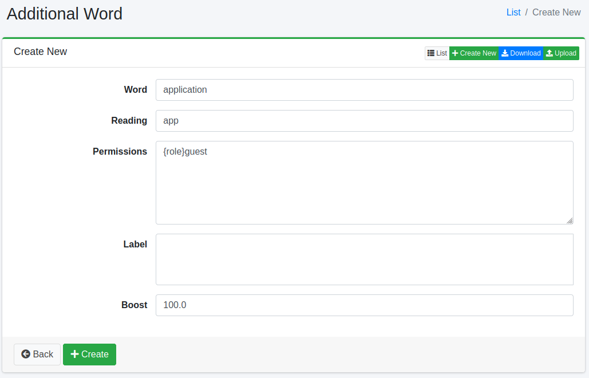
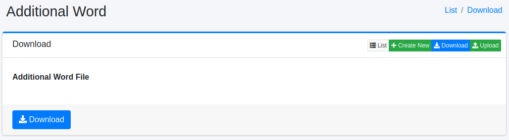

================
Mots ajoutés
============

Présentation
============

Cette section explique la configuration des candidats de mots ajoutés pour les suggestions. Les suggestions sont affichées en fonction des termes de recherche, et vous pouvez ajouter ces mots.

Gestion
=======

Affichage
---------

Pour ouvrir la page de liste pour configurer les mots ajoutés illustrée ci-dessous, cliquez sur [Suggestion > Mots ajoutés] dans le menu de gauche.

|image0|

Cliquez sur le nom de la configuration pour la modifier.

Création de configuration
-------------------------

Cliquez sur le bouton Nouvelle création pour ouvrir la page de configuration des mots ajoutés.

|image1|

Paramètres de configuration
---------------------------

Mot
::::

Spécifie le mot à afficher comme candidat de suggestion.

Lecture
:::::::

Spécifie la lecture phonétique du mot candidat de suggestion.

Permission
::::::::::

Configure les informations de rôle pour le mot.
La suggestion n'est affichée que pour les utilisateurs ayant le rôle configuré.

Étiquette
:::::::::

Configure l'étiquette pour le mot.
Si une étiquette autre que celle configurée est sélectionnée, elle ne sera pas affichée dans les suggestions.

Valeur de boost
:::::::::::::::

Configure la valeur de boost pour le mot.

Suppression de configuration
----------------------------

Cliquez sur le nom de la configuration dans la page de liste, puis cliquez sur le bouton Supprimer pour afficher l'écran de confirmation.
Appuyer sur le bouton Supprimer supprimera la configuration.

Téléchargement
==============

Télécharge les mots enregistrés au format CSV.

|image2|

Contenu du CSV
--------------

La première ligne est l'en-tête.
Les mots ajoutés sont listés à partir de la deuxième ligne.

::

"SuggestWord","Reading","Role","Label","Boost"
"fess","ふぇす","role1","label1","100"

Téléversement
=============

Enregistre les mots au format CSV.

|image3|

Contenu du CSV
--------------

La première ligne est l'en-tête.
Décrivez les mots ajoutés à partir de la deuxième ligne.

::

"SuggestWord","Reading","Role","Label","Boost"
"fess","ふぇす","role1","label1","100"

.. |image0| image:: ../../../resources/images/en/15.3/admin/elevateword-1.png

.. |image3| image:: ../../../resources/images/en/15.3/admin/elevateword-4.png
