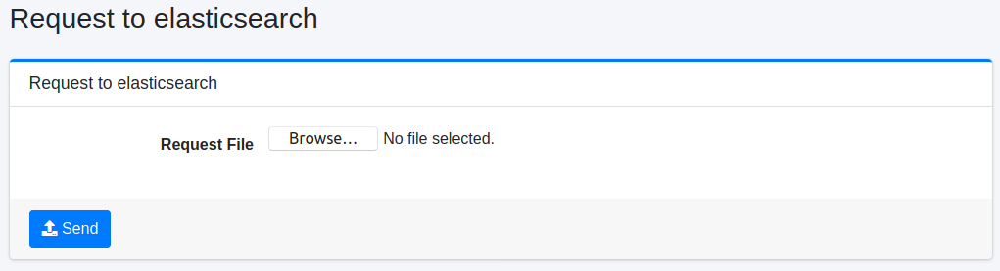

====================
Requête de recherche
====================

Présentation
============

Cette page envoie des requêtes de recherche de fichiers JSON à OpenSearch.

|image0|

Méthode d'opération
===================

Envoi de requête
----------------

Après vous être connecté en tant qu'administrateur, entrez /admin/esreq/ comme chemin d'URL.
Créez la requête de recherche que vous souhaitez envoyer à OpenSearch sous forme de fichier JSON, sélectionnez ce fichier JSON comme « Fichier de requête », cliquez sur le bouton « Envoyer » pour envoyer la requête à OpenSearch.
La réponse est téléchargée sous forme de fichier.

Paramètres de configuration
----------------------------

Fichier de requête
::::::::::::::::::

Spécifiez le fichier JSON décrivant le DSL de requête.
Par exemple, le contenu du fichier JSON serait comme suit.

::

    POST /_search
    {
      "query": {
        "match_all": {}
      }
    }

