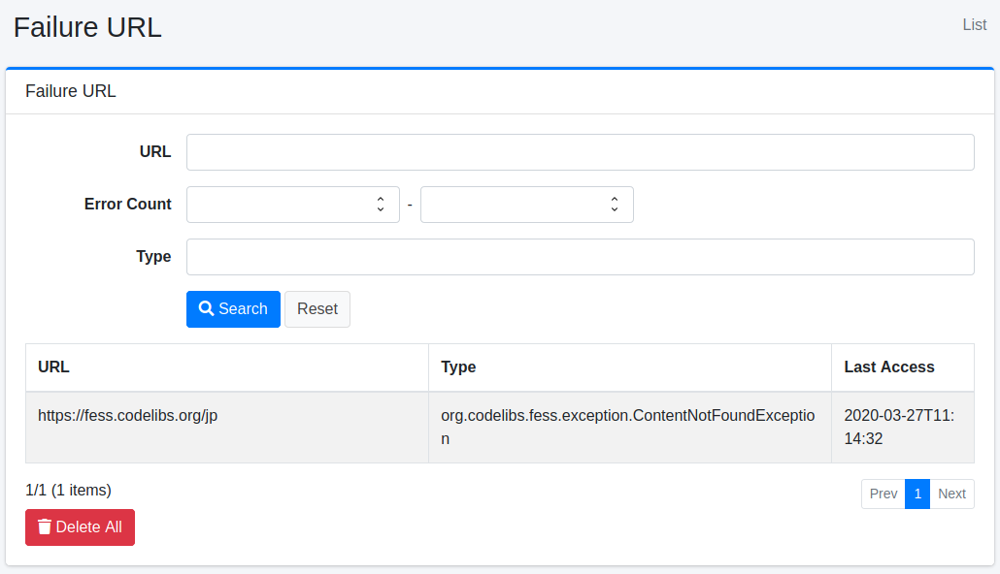
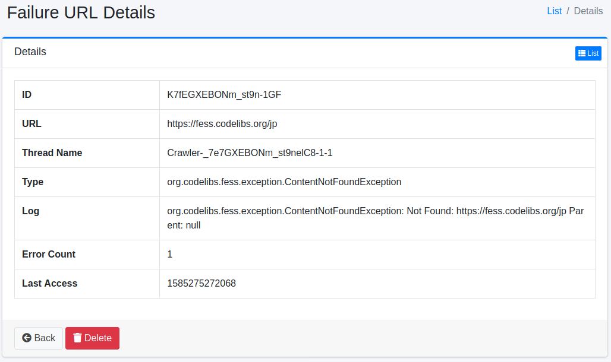

==================
URL en échec
============

Présentation
============

Cette section explique les URL en échec.
Les URL qui n'ont pas pu être obtenues lors du crawl sont enregistrées et peuvent être vérifiées comme URL en échec.

Gestion
=======

Affichage
---------

Pour ouvrir la page de liste pour vérifier les URL en échec, cliquez sur [Informations système > URL en échec] dans le menu de gauche.

|image0|

En cliquant sur le lien de vérification de l'URL en échec, les détails s'affichent.

Détails de l'URL en échec
=========================

Les détails de l'URL en échec enregistrent les exceptions survenues lors du crawl.

|image1|

Contenu des détails
-------------------

URL
::::

URL où l'exception s'est produite.

Nom du thread
:::::::::::::

Nom du thread qui exécutait le crawl.
Peut être utilisé lors de la vérification des fichiers journaux.

Type
::::

Type d'exception.

Journal
:::::::

Contenu de l'exception.

Nombre d'erreurs
::::::::::::::::

Nombre de fois où cette exception s'est produite.

Date du dernier accès
:::::::::::::::::::::

Heure à laquelle cette exception s'est produite.

