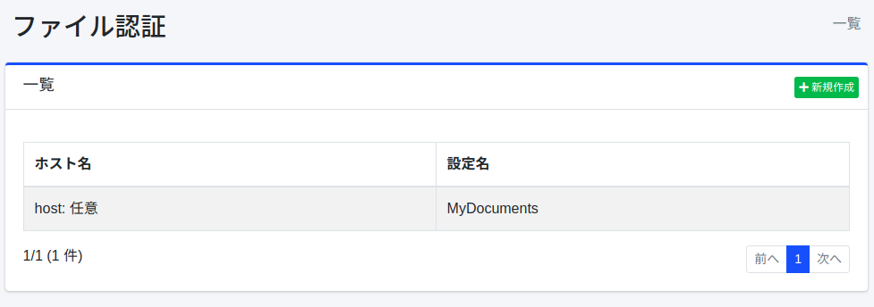
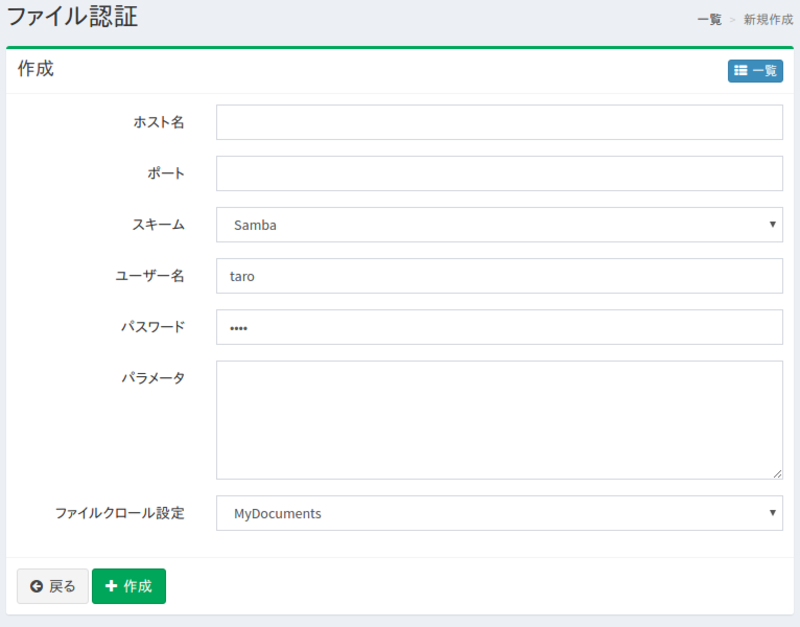

==========================
Authentification de fichier
===========================

Présentation
============

Cette section explique la méthode de configuration lorsqu'une authentification de fichier est requise pour le crawl ciblant les fichiers.
|Fess| prend en charge l'authentification FTP ou pour les dossiers partagés Windows.

Gestion
=======

Affichage
---------

Pour ouvrir la page de liste pour configurer l'authentification de fichier illustrée ci-dessous, cliquez sur [Crawler > Authentification de fichier] dans le menu de gauche.

|image0|

Cliquez sur le nom de la configuration pour la modifier.

Création de configuration
-------------------------

Cliquez sur le bouton Nouvelle création pour ouvrir la page de configuration d'authentification de fichier.

|image1|

Paramètres de configuration
---------------------------

Nom d'hôte
::::::::::

Spécifie le nom d'hôte du site nécessitant une authentification.

Port
::::

Spécifie le port du site nécessitant une authentification.

Schéma
::::::

Sélectionnez la méthode d'authentification.
Vous pouvez utiliser FTP ou SAMBA (authentification de dossier partagé Windows).

Nom d'utilisateur
:::::::::::::::::

Spécifie le nom d'utilisateur pour se connecter au site d'authentification.

Mot de passe
::::::::::::

Spécifie le mot de passe pour se connecter au site d'authentification.

Paramètres
::::::::::

Configure s'il existe des valeurs de configuration nécessaires pour se connecter au site d'authentification. Pour SAMBA, vous pouvez définir la valeur de domain. Pour la configurer, décrivez comme suit :

::

    domain=FUGA

Configuration de crawl de fichiers
:::::::::::::::::::::::::::::::::::

Spécifie la configuration de crawl qui utilisera ces paramètres d'authentification.

Suppression de configuration
----------------------------

Cliquez sur le nom de la configuration dans la page de liste, puis cliquez sur le bouton Supprimer pour afficher l'écran de confirmation.
Appuyer sur le bouton Supprimer supprimera la configuration.

