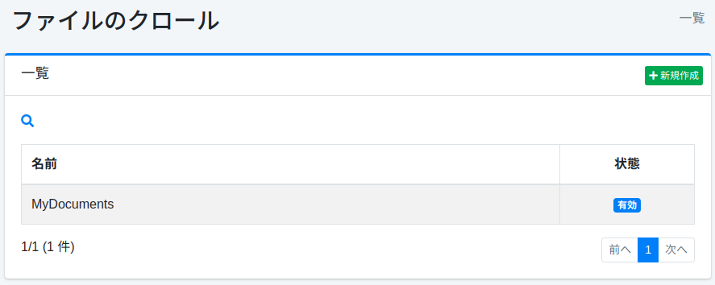

==========================
Crawl de système de fichiers
============================

Présentation
============

La page de configuration de crawl de fichiers permet de gérer la configuration pour crawler les fichiers sur le système de fichiers ou les dossiers partagés sur le réseau.

Gestion
=======

Affichage
---------

Pour ouvrir la page de liste pour configurer le crawl de fichiers illustrée ci-dessous, cliquez sur [Crawler > Système de fichiers] dans le menu de gauche.

|image0|

Cliquez sur le nom de la configuration pour la modifier.

Création de configuration
-------------------------

Cliquez sur le bouton Nouvelle création pour ouvrir la page de configuration de crawl de fichiers.

|image1|

Paramètres de configuration
---------------------------

Nom
::::

Nom de la configuration.

Chemin
::::::

Ce chemin spécifie l'emplacement de départ du crawl (ex. : file:/ ou smb://).

Chemins à crawler
:::::::::::::::::

Les chemins correspondant à l'expression régulière (format Java) spécifiée dans cet élément seront ciblés par le crawler |Fess|.

Chemins exclus du crawl
:::::::::::::::::::::::

Les chemins correspondant à l'expression régulière (format Java) spécifiée dans cet élément ne seront pas ciblés par le crawler |Fess|.

Chemins à indexer
:::::::::::::::::

Les chemins correspondant à l'expression régulière (format Java) spécifiée dans cet élément seront ciblés pour la recherche.

Chemins exclus de l'indexation
:::::::::::::::::::::::::::::::

Les chemins correspondant à l'expression régulière (format Java) spécifiée dans cet élément ne seront pas ciblés pour la recherche.

Paramètres de configuration
::::::::::::::::::::::::::::

Vous pouvez spécifier les informations de configuration du crawl.

Profondeur
::::::::::

Spécifie la profondeur de la structure du système de fichiers à crawler.

Nombre maximum d'accès
::::::::::::::::::::::

Spécifie le nombre de chemins à indexer.

Nombre de threads
:::::::::::::::::

Spécifie le nombre de threads à utiliser pour cette configuration.

Intervalle
::::::::::

Spécifie le temps d'attente pour chaque thread lors du crawl des chemins.

Valeur de boost
:::::::::::::::

La valeur de boost est la priorité des documents indexés par cette configuration.

Permission
::::::::::

Spécifie la permission pour cette configuration.
Pour la méthode de spécification de permission, par exemple, pour afficher les résultats de recherche aux utilisateurs appartenant au groupe developer, spécifiez {group}developer.
La spécification par utilisateur est {user}nom_utilisateur, par rôle {role}nom_rôle, par groupe {group}nom_groupe.

Hôte virtuel
::::::::::::

Spécifie le nom d'hôte de l'hôte virtuel.
Pour plus de détails, consultez :doc:`Configuration de l'hôte virtuel dans le guide de configuration <../config/virtual-host>`.

État
::::

Lorsque cette configuration est active, la tâche du crawler par défaut effectue le crawl en incluant cette configuration.

Description
:::::::::::

Vous pouvez saisir une description.

Suppression de configuration
----------------------------

Cliquez sur le nom de la configuration dans la page de liste, puis cliquez sur le bouton Supprimer pour afficher l'écran de confirmation. Appuyer sur le bouton Supprimer supprimera la configuration.

Exemples
========

Crawler les fichiers locaux
---------------------------

Pour crawler les fichiers sous /home/share, la configuration serait la suivante.

.. tabularcolumns:: |p{4cm}|p{8cm}|
.. list-table::
   :header-rows: 1

   * - Nom
     - Valeur
   * - Nom
     - Répertoire partagé
   * - Chemin
     - file:/home/share

Les autres paramètres peuvent utiliser la configuration par défaut.

Crawler les dossiers partagés Windows
-------------------------------------

Pour crawler les fichiers sous \\SERVER\SharedFolder, la configuration serait la suivante.

.. tabularcolumns:: |p{4cm}|p{8cm}|
.. list-table::
   :header-rows: 1

   * - Nom
     - Valeur
   * - Nom
     - Dossier partagé
   * - Chemin
     - smb://SERVER/SharedFolder/

Si l'accès au dossier partagé nécessite un nom d'utilisateur/mot de passe, vous devez créer une configuration d'authentification de fichier depuis [Crawler > Authentification de fichier] dans le menu de gauche.
La configuration serait alors la suivante.

.. tabularcolumns:: |p{4cm}|p{8cm}|
.. list-table::
   :header-rows: 1

   * - Nom
     - Valeur
   * - Nom d'hôte
     - SERVER
   * - Schéma
     - SAMBA
   * - Nom d'utilisateur
     - (Veuillez saisir)
   * - Mot de passe
     - (Veuillez saisir)

.. |image1| image:: ../../../resources/images/ja/15.3/admin/fileconfig-2.png
.. pdf            :height: 940 px
