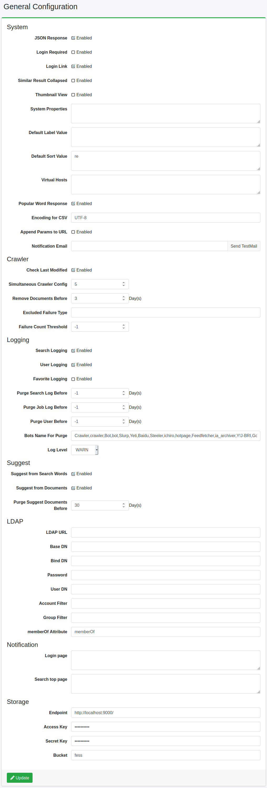

========
Général
========

Présentation
============

Cette page d'administration vous permet de gérer les paramètres de |Fess|.
Vous pouvez modifier divers paramètres de |Fess| sans redémarrer |Fess|.

|image0|

Contenu de la configuration
============================

Système
-------

Réponse JSON
::::::::::::

Spécifie s'il faut activer l'API JSON.

Connexion requise
:::::::::::::::::

Spécifie si la connexion est requise pour la fonction de recherche.

Afficher le lien de connexion
::::::::::::::::::::::::::::::

Configure l'affichage du lien vers la page de connexion sur l'écran de recherche.

Replier les résultats en double
::::::::::::::::::::::::::::::::

Configure l'activation du repliement des résultats en double.

Affichage des vignettes
::::::::::::::::::::::::

Configure l'activation de l'affichage des vignettes.

Valeur d'étiquette par défaut
::::::::::::::::::::::::::::::

Décrit la valeur d'étiquette à ajouter aux critères de recherche par défaut.
Pour spécifier par rôle ou groupe, ajoutez « role: » ou « group: » comme « role:admin=label1 ».

Valeur de tri par défaut
:::::::::::::::::::::::::

Décrit la valeur de tri à ajouter aux critères de recherche par défaut.
Pour spécifier par rôle ou groupe, ajoutez « role: » ou « group: » comme « role:admin=content_length.desc ».

Hôte virtuel
::::::::::::

Configure l'hôte virtuel.
Pour plus de détails, consultez :doc:`Configuration de l'hôte virtuel dans le guide de configuration <../config/virtual-host>`.

Réponse des mots populaires
::::::::::::::::::::::::::::

Spécifie s'il faut activer l'API des mots populaires.

Encodage du fichier CSV
::::::::::::::::::::::::

Spécifie l'encodage des fichiers CSV à télécharger.

Ajouter des paramètres de recherche
::::::::::::::::::::::::::::::::::::

Active le passage de paramètres à l'affichage des résultats de recherche.

E-mail de notification
::::::::::::::::::::::

Spécifie l'adresse e-mail pour la notification à la fin du crawl.
Plusieurs adresses peuvent être spécifiées séparées par des virgules. Un serveur de messagerie est requis pour l'utilisation.

Crawler
-------

Vérifier la date de dernière modification
::::::::::::::::::::::::::::::::::::::::::

Active le crawl différentiel.

Configuration du crawler simultané
:::::::::::::::::::::::::::::::::::

Spécifie le nombre de configurations de crawl à exécuter simultanément.

Supprimer les documents précédents
:::::::::::::::::::::::::::::::::::

Spécifie le nombre de jours de la période de validité après l'indexation.

Types d'erreur exclus
:::::::::::::::::::::

Les URL en échec qui dépassent le seuil sont exclues des cibles de crawl, mais les noms d'exception spécifiés ici seront des cibles de crawl même si elles dépassent le seuil.

Seuil du nombre d'échecs
:::::::::::::::::::::::::

Si le document cible de crawl est enregistré dans les URL en échec plus que le nombre de fois spécifié ici, il sera exclu du prochain crawl.

Journalisation
--------------

Journal de recherche
::::::::::::::::::::

Spécifie s'il faut activer l'enregistrement du journal de recherche.

Journal utilisateur
:::::::::::::::::::

Spécifie s'il faut activer l'enregistrement du journal utilisateur.

Journal des favoris
:::::::::::::::::::

Spécifie s'il faut activer l'enregistrement du journal des favoris.

Supprimer les journaux de recherche précédents
:::::::::::::::::::::::::::::::::::::::::::::::

Supprime les journaux de recherche antérieurs au nombre de jours spécifié.

Supprimer les journaux de tâches précédents
::::::::::::::::::::::::::::::::::::::::::::

Supprime les journaux de tâches antérieurs au nombre de jours spécifié.

Supprimer les journaux utilisateur précédents
::::::::::::::::::::::::::::::::::::::::::::::

Supprime les journaux utilisateur antérieurs au nombre de jours spécifié.

Nom de bot pour supprimer les journaux
:::::::::::::::::::::::::::::::::::::::

Spécifie le nom du bot à exclure des journaux de recherche.

Niveau de journalisation
:::::::::::::::::::::::::

Spécifie le niveau de journalisation de fess.log.

Suggestion
----------

Suggestion avec mots de recherche
::::::::::::::::::::::::::::::::::

Spécifie s'il faut générer des candidats de suggestion à partir des journaux de recherche.

Suggestion avec documents
:::::::::::::::::::::::::

Spécifie s'il faut générer des candidats de suggestion à partir des documents indexés.

Supprimer les informations de suggestion précédentes
:::::::::::::::::::::::::::::::::::::::::::::::::::::

Supprime les données de suggestion antérieures au nombre de jours spécifié.

LDAP
----

URL LDAP
::::::::

Spécifie l'URL du serveur LDAP.

Base DN
:::::::

Spécifie le nom distinctif de base pour se connecter à l'écran de recherche.

Bind DN
:::::::

Spécifie le Bind DN de l'administrateur.

Mot de passe
::::::::::::

Spécifie le mot de passe du Bind DN.

User DN
:::::::

Spécifie le nom distinctif de l'utilisateur.

Filtre de compte
::::::::::::::::

Spécifie le nom commun de l'utilisateur, l'uid, etc.

Filtre de groupe
::::::::::::::::

Spécifie les conditions de filtre pour les groupes à récupérer.

Attribut memberOf
:::::::::::::::::

Spécifie le nom de l'attribut memberOf disponible sur le serveur LDAP.
Pour Active Directory, c'est memberOf.
Pour d'autres serveurs LDAP, cela peut être isMemberOf.

Affichage des annonces
----------------------

Page de connexion
:::::::::::::::::

Décrit le message à afficher sur l'écran de connexion.

Page d'accueil de recherche
::::::::::::::::::::::::::::

Décrit le message à afficher sur l'écran d'accueil de recherche.

Stockage
--------

Après avoir configuré chaque élément, un menu [Système > Stockage] apparaîtra dans le menu de gauche.
Pour la gestion des fichiers, consultez :doc:`Stockage <../admin/storage-guide>`.

Point de terminaison
::::::::::::::::::::

Spécifie l'URL du point de terminaison du serveur MinIO.

Clé d'accès
:::::::::::

Spécifie la clé d'accès du serveur MinIO.

Clé secrète
:::::::::::

Spécifie la clé secrète du serveur MinIO.

Bucket
::::::

Spécifie le nom du bucket à gérer.

Exemples
========

Exemples de configuration LDAP
-------------------------------

.. tabularcolumns:: |p{4cm}|p{4cm}|p{4cm}|
.. list-table:: Configuration LDAP/Active Directory
   :header-rows: 1

   * - Nom
     - Valeur (LDAP)
     - Valeur (Active Directory)
   * - URL LDAP
     - ldap://SERVERNAME:389
     - ldap://SERVERNAME:389
   * - Base DN
     - cn=Directory Manager
     - dc=fess,dc=codelibs,dc=org
   * - Bind DN
     - uid=%s,ou=People,dc=fess,dc=codelibs,dc=org
     - manager@fess.codelibs.org
   * - User DN
     - uid=%s,ou=People,dc=fess,dc=codelibs,dc=org
     - %s@fess.codelibs.org
   * - Filtre de compte
     - cn=%s ou uid=%s
     - (&(objectClass=user)(sAMAccountName=%s))
   * - Filtre de groupe
     -
     - (member:1.2.840.113556.1.4.1941:=%s)
   * - memberOf
     - isMemberOf
     - memberOf

.. pdf            :height: 940 px
