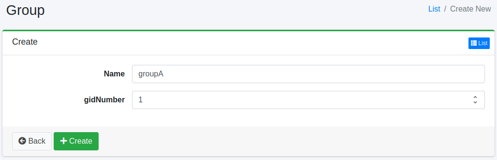

========
Groupe
========

Présentation
============

Vous pouvez gérer les groupes auxquels les utilisateurs appartiennent.
Cela peut être utilisé pour l'intégration LDAP, par exemple.

Gestion
=======

Affichage
---------

Pour ouvrir la page de liste pour configurer les groupes illustrée ci-dessous, cliquez sur [Utilisateur > Groupe] dans le menu de gauche.

|image0|

Cliquez sur le nom de la configuration pour la modifier.

Création de configuration
--------------------------

Cliquez sur le bouton Nouvelle création pour ouvrir la page de configuration des groupes.

|image1|

Paramètres de configuration
----------------------------

Nom
::::

Nom du groupe.

Méthode de suppression
----------------------

Cliquez sur le nom de la configuration dans la page de liste, puis cliquez sur le bouton Supprimer pour afficher l'écran de confirmation.
Appuyer sur le bouton Supprimer supprimera la configuration.

.. |image0| image:: ../../../resources/images/en/15.3/admin/group-1.png

