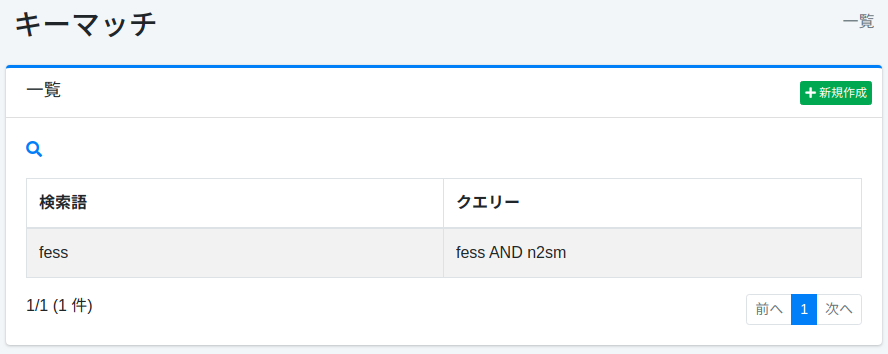
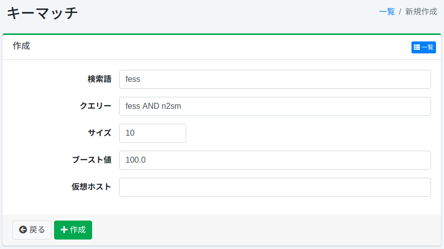

=====================
Correspondance de clés
=====================

Présentation
============

Cette section explique la configuration de la correspondance de clés.
En configurant la correspondance de clés, vous pouvez positionner des documents en haut des résultats de recherche lorsqu'une recherche est effectuée avec le terme de recherche enregistré.
Une utilisation courante est la publicité.

Gestion
=======

Affichage
---------
Pour ouvrir la page de liste de configuration de correspondance de clés illustrée ci-dessous, cliquez sur [Crawler > Correspondance de clés] dans le menu de gauche.

|image0|

Cliquez sur le nom de la configuration pour la modifier.

Création de configuration
--------------------------

Cliquez sur le bouton Nouvelle création pour ouvrir la page de configuration de correspondance de clés.

|image1|

Paramètres de configuration
----------------------------

Terme de recherche
::::::::::::::::::

La pondération n'est appliquée que dans les résultats de recherche pour ce terme de recherche.

Requête
:::::::

Les documents cibles à positionner en haut sont déterminés par la requête de recherche.

Taille
::::::

Spécifie le nombre maximum de documents correspondant à la requête.

Valeur de boost
:::::::::::::::

Spécifie la valeur de pondération du document.

Hôte virtuel
::::::::::::

Spécifie le nom d'hôte de l'hôte virtuel.
Pour plus de détails, consultez :doc:`Configuration de l'hôte virtuel dans le guide de configuration <../config/virtual-host>`.

Suppression de configuration
-----------------------------

Cliquez sur le nom de la configuration dans la page de liste, puis cliquez sur le bouton Supprimer pour afficher l'écran de confirmation.
Appuyer sur le bouton Supprimer supprimera la configuration.

