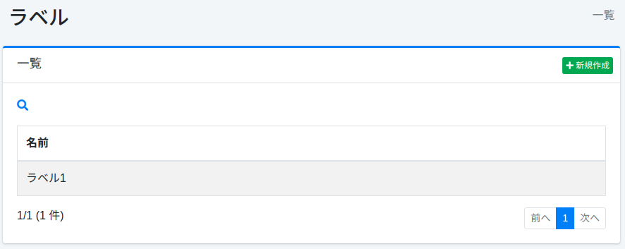

==========
Étiquette
=========

Présentation
============

Cette section explique la configuration des étiquettes.
Les étiquettes permettent de classifier les documents affichés dans les résultats de recherche.
La configuration des étiquettes spécifie les chemins auxquels ajouter des étiquettes par expression régulière.
Si des étiquettes sont enregistrées, une liste déroulante d'étiquettes s'affiche dans les options de recherche.

Cette configuration d'étiquette est appliquée aux configurations de crawl Web ou de système de fichiers.

Gestion
=======

Affichage
---------

Pour ouvrir la page de liste de configuration des étiquettes illustrée ci-dessous, cliquez sur [Crawler > Étiquette] dans le menu de gauche.

|image0|

Cliquez sur le nom de la configuration pour la modifier.

Création de configuration
-------------------------

Cliquez sur le bouton Nouvelle création pour ouvrir la page de configuration des étiquettes.

|image1|

Paramètres de configuration
---------------------------

Nom
::::

Spécifie le nom affiché dans la liste déroulante de sélection d'étiquette lors de la recherche.

Valeur
::::::

Spécifie l'identifiant lors de la classification des documents.
Spécifiez en caractères alphanumériques.

Chemins cibles
::::::::::::::

Configure les chemins auxquels ajouter l'étiquette par expression régulière.
Vous pouvez en spécifier plusieurs en écrivant sur plusieurs lignes.
L'étiquette sera définie pour les documents correspondant aux chemins spécifiés ici.

Chemins exclus
::::::::::::::

Configure par expression régulière ce que vous souhaitez exclure des chemins cibles de crawl.
Vous pouvez en spécifier plusieurs en écrivant sur plusieurs lignes.

Permission
::::::::::

Spécifie la permission pour cette configuration.
Pour la méthode de spécification de permission, par exemple, pour afficher les résultats de recherche aux utilisateurs appartenant au groupe developer, spécifiez {group}developer.
La spécification par utilisateur est {user}nom_utilisateur, par rôle {role}nom_rôle, par groupe {group}nom_groupe.

Hôte virtuel
::::::::::::

Spécifie le nom d'hôte de l'hôte virtuel.
Pour plus de détails, consultez :doc:`Configuration de l'hôte virtuel dans le guide de configuration <../config/virtual-host>`.

Ordre d'affichage
:::::::::::::::::

Spécifie l'ordre d'affichage des étiquettes.

Suppression de configuration
----------------------------

Cliquez sur le nom de la configuration dans la page de liste, puis cliquez sur le bouton Supprimer pour afficher l'écran de confirmation.
Appuyer sur le bouton Supprimer supprimera la configuration.

.. |image1| image:: ../../../resources/images/ja/15.3/admin/labeltype-2.png
