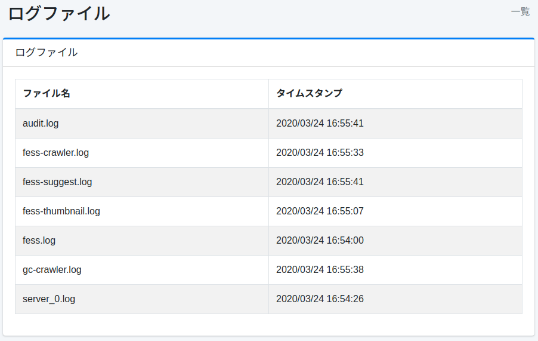

==================
Fichiers journaux
==================

Présentation
============

Cette section explique le téléchargement des fichiers journaux générés par |Fess|.

Méthode de configuration
=========================

Affichage
---------

Pour ouvrir la page des fichiers journaux illustrée ci-dessous, cliquez sur [Informations système > Fichiers journaux] dans le menu de gauche.

|image0|

Téléchargement
--------------

Vous pouvez télécharger un fichier journal en cliquant sur le nom du fichier journal affiché.

``server_*.log``
::::::::::::::::

Les journaux de |Fess| en tant que serveur d'application sont enregistrés.

fess.log
::::::::

Les journaux de |Fess| en tant qu'application sont enregistrés.

fess-crawler.log
::::::::::::::::

Les journaux du crawler sont enregistrés.

audit.log
:::::::::

Les informations de connexion et les journaux d'accès à l'écran d'administration sont enregistrés.

fess-thumbnail.log
::::::::::::::::::

Les journaux de la fonctionnalité de vignettes sont enregistrés.

fess-suggest.log
::::::::::::::::

Les journaux de la fonctionnalité de suggestion sont enregistrés.

fess-urls.log
:::::::::::::

Le temps nécessaire pour un crawl est enregistré.

search.log
::::::::::

Les journaux de recherche sont enregistrés.

gc-crawler.log
::::::::::::::

Les journaux GC de fess sont enregistrés.

