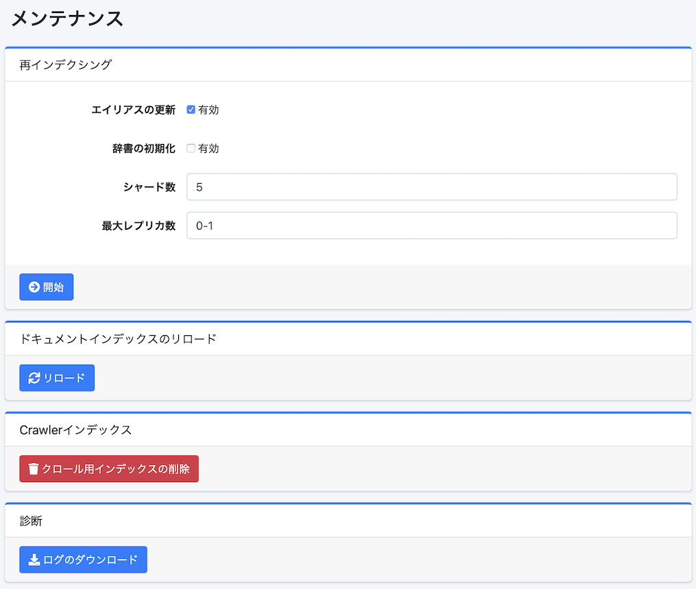

==============
Maintenance
==============

Présentation
============

La page de maintenance est utilisée pour exécuter des opérations de données système.

|image0|

Méthode d'opération
===================

Réindexation
------------

Vous pouvez recréer un nouvel index à partir de l'index fess existant.
Exécutez cela lorsque vous souhaitez modifier le mapping de l'index, par exemple.

Paramètres de configuration
----------------------------

Mise à jour de l'alias
::::::::::::::::::::::

En l'activant, après la fin de la réindexation, vous pouvez réattribuer les alias fess.search et fess.update assignés à l'index existant au nouvel index.

Initialisation du dictionnaire
:::::::::::::::::::::::::::::::

En l'activant, vous pouvez initialiser la configuration du dictionnaire.

Nombre de shards
::::::::::::::::

Vous pouvez spécifier le nombre de shards OpenSearch (index.number_of_shards).

Nombre maximum de réplicas
:::::::::::::::::::::::::::

Vous pouvez spécifier le nombre maximum de réplicas OpenSearch (index.auto_expand_replicas).

Rechargement de l'index de documents
-------------------------------------

Vous pouvez recharger l'index de documents pour appliquer la configuration de l'index.

Index Crawler
-------------

Vous pouvez supprimer l'index fess_crawler (informations de crawl).
Ne l'exécutez pas pendant l'exécution du crawler.

Diagnostic
----------

Vous pouvez télécharger les fichiers journaux au format zip.

