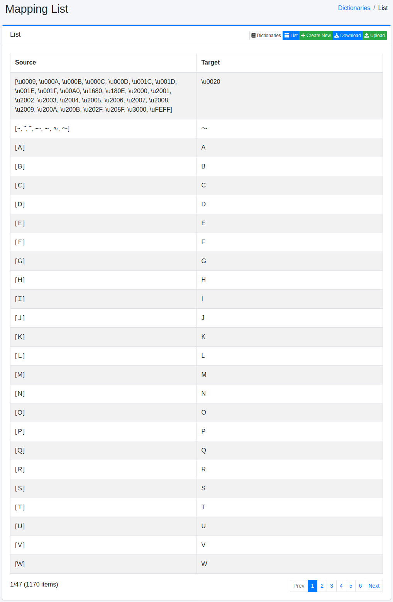
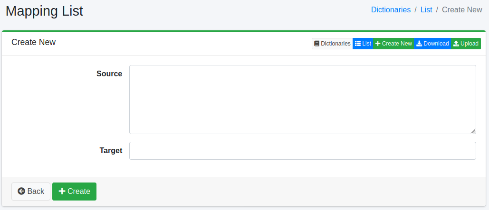

=====================
Dictionnaire de mapping
=======================

Présentation
============

Vous pouvez mapper des caractères spécifiques (symboles, codes de caractères, pleine/demi-largeur) vers d'autres caractères.

Gestion
=======

Affichage
---------

Pour ouvrir la page de liste de configuration de mapping illustrée ci-dessous, sélectionnez [Système > Dictionnaire] dans le menu de gauche, puis cliquez sur mapping.

|image0|

Cliquez sur le nom de la configuration pour la modifier.

Méthode de configuration
------------------------

Cliquez sur le bouton Nouvelle création pour ouvrir la page de configuration de mapping.

|image1|

Paramètres de configuration
---------------------------

Source de conversion
:::::::::::::::::::::

Entrez les caractères (symboles, codes de caractères, pleine/demi-largeur) à mapper.

Après conversion
::::::::::::::::

Développe les caractères entrés dans la source de conversion avec les caractères après conversion.

Téléchargement
==============

Vous pouvez télécharger au format de dictionnaire de mapping.

Téléversement
=============

Vous pouvez téléverser au format de dictionnaire de mapping.

